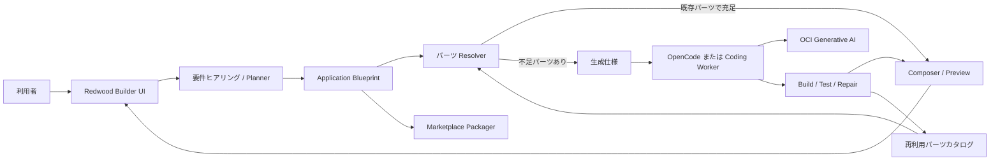

# JetUse AIアプリケーションビルダー構想

日付: 2026-06-30

状態: 構想・議論まとめ（実装決定前）

> **方針更新（2026-06-30）:** 本書は初期検討の記録として残す。最新方針では、AIバックエンドの動的生成を主題から外し、`main`に実装・動作確認済みのOCI AIリファレンス実装をDemo Validityの基準とする。その上に、顧客の案件確度を高める高品質なUI/UX、データ、Web / SaaS Experienceを生成する。実装方針の正本は[Experience Builder — main安定版からの実装方針](./experience-builder-implementation-strategy.md)を参照。
>
> 最新方針の利用主体は、**Builderを使うプリセールスエンジニア**と、**生成されたデモを使う顧客**に分かれる。顧客向けセルフサービスBuilderは初期スコープに含めない。
>
> 最新方針の第一価値は再利用や作成速度ではなく、**コーディングやAIアーキテクチャに詳しくないプリセールスでも、JetUseのリファレンス実装を使い、顧客が見た目・触り心地・業務適合性に魅力を感じるデモを完成できること**である。技術的な本番構想が必要になった案件は専任チームへ引き継ぐ。
>
> 顧客接点はGenerated Redwood UIだけに限定しない。Slackを最初のSaaS Reference Integrationとし、SaaS-nativeな質問・通知・確認と、詳細なWeb Experienceを組み合わせる。

## 1. この文書の目的

JetUseを、現在の「プロンプトテンプレートを作るユースケースビルダー」から、より汎用的なAIアプリケーションを作成できるプラットフォームへ発展させる構想をまとめる。

目指すものは、完全なノーコードツールでも、AIにリポジトリを自由編集させるだけのコーディングエージェントでもない。中心に置くのは、アプリの構成を宣言する **Application Blueprint** と、Blueprintだけでは表現できない不足部分を補う **AIコード生成ループ** である。

本構想の要点は次のとおり。

- 利用者は自然言語と構造化された質問への回答からAIアプリを設計できる。
- 通常は、JetUseが用意した画面、AI能力、データ、ワークフロー、コネクタをBlueprint上で組み合わせる。
- 既存パーツだけで実現できない場合に限り、OpenCodeなどのコーディングエージェントとOCI Generative AIを使って不足部分を生成する。
- 生成された画面はJetUse既存のRedwoodデザイントークンとコンポーネントを利用する。
- 完成したBlueprintや部品は、既存のマーケットプレイスの配布モデルへ接続する。
- OpenAIやAnthropicのAPIキーを製品の前提にせず、OCI Generative AIを第一候補とする。

本書はまず**機能として成立するか**を整理する。セキュリティ、費用、運用体制、詳細な権限設計は別途検討する。

## 2. 現在のJetUse

### 2.1 マーケットプレイスの実態

現在のマーケットプレイスは、一般的なアプリストアのように任意のプログラム一式をダウンロードして実行する仕組みではない。中央レジストリからJSON manifestを取得し、manifestの`kind`に応じたJetUse内部の受け皿へ、版を固定して取り込む仕組みである。

現在配布できるものは次の5種類である。

| 種類 | 非技術的な説明 | 実際に配布されるもの | インストール後の扱い |
|---|---|---|---|
| `usecase` | 入力フォーム付きのAI作業テンプレート | 入力項目、プロンプトテンプレート、モデル、表示情報 | 既存ユースケースエンジンで実行する |
| `agent` | AI担当者の職務定義 | 指示、モデル、利用ツール、MCPサーバー、実行フレームワーク | 既存エージェント実行基盤で動かす |
| `sample-app` | 業務アプリの設計図 | 画面、データセット、初期データ、AI能力を差し込むスロット | JetUse内にアプリ構成をscaffoldする |
| `connector` | 外部サービスを使うための接続口 | 接続方式、公開操作、認証方式の定義 | 組み込み実装またはMCP接続へ束縛する |
| `external-app` | 別アプリへの統合された入口 | URL、iframe/link方式、表示情報、任意のSSO連携定義 | JetUseから外部アプリを起動・埋め込み表示する |

たとえで表現すると、`usecase`は「記入用紙と作業指示書」、`agent`は「担当者の職務記述書と道具一覧」、`sample-app`は「画面とデータの間取り図」、`connector`は「外部サービス用アダプターの規格」、`external-app`は「別棟への入口」である。

5種類とも、基本的には**実行コードそのものではなく、JetUseが解釈する定義**を配布する。これは既存マーケットプレイスの重要な性格である。

実装上の正本は以下にある。

- manifestの種類と共通構造: [`plugins/manifest.py`](../../packages/api/jetuse_core/plugins/manifest.py)
- 取り込み処理: [`plugins/installer.py`](../../packages/api/jetuse_core/plugins/installer.py)
- マーケットプレイスAPI: [`routes/marketplace.py`](../../packages/api/service/routes/marketplace.py)
- 詳細仕様: [`specs/16-platform.md`](../../specs/16-platform.md)

### 2.2 現在のユースケースビルダー

現在の`/builder`は、`usecase`定義を編集する機能である。利用者が設定できるものは次の範囲に限られる。

- 名前、説明、アイコン、タグ、公開範囲
- 使用モデル
- 入力フィールド
  - `text`
  - `textarea`
  - `select`
  - `number`
  - `url`
- 入力値を埋め込むプロンプトテンプレート
- 実行フォームのライブプレビュー
- 保存、編集、削除、マーケットプレイスへの公開

作られるものは基本的に、次の一方向の処理である。

```text
入力フォーム → プロンプトテンプレート展開 → LLM実行 → テキスト結果
```

この仕組みは翻訳、要約、メール作成、分類などには適している。一方、複数画面、業務データ、状態遷移、RAG、外部連携、複数のAI処理を含むアプリを作る機能ではない。そのため、現状のままでは「ビルダー」と呼ぶ効果が限定的である。

実装は [`builder.tsx`](../../packages/web/src/pages/builder.tsx) と [`UsecaseDefinition`](../../packages/api/service/schemas.py) を参照。

## 3. 目指すプロダクト像

### 3.1 「プロンプトを作る」から「AIアプリを設計する」へ

新しいビルダーでは、利用者は例えば次のような要求を入力する。

> 問い合わせを受け付け、社内文書から回答候補を作り、担当者が確認してから返信できるアプリを作りたい。

ビルダーは不足情報を質問し、次を設計する。

- 誰が何のために使うか
- 必要な画面と画面遷移
- 扱うデータとその項目
- 利用するAI能力
- 人間の確認を挟む場所
- 外部サービスとの接続
- 使用するJetUse部品

利用者はソースコードではなく、構成、プレビュー、AIが作った内容を確認しながら完成させる。

### 3.2 Application Blueprint

アプリ全体の正本として、Application Blueprintを導入する。

Blueprintは、アプリを再生成、検証、編集、共有するための中間表現である。次の要素を持つ。

- アプリのメタデータ
- 画面とナビゲーション
- Redwood UIコンポーネント
- データモデル
- AI能力とモデル要件
- ワークフローと状態遷移
- コネクタ
- JetUseランタイムへの束縛

概念例を以下に示す。これはスキーマ確定案ではない。

```yaml
apiVersion: jetuse.oracle.com/v1alpha1
kind: ApplicationBlueprint
metadata:
  name: support-assistant
  title: 問い合わせ対応アシスタント

experience:
  designSystem: jetuse-redwood
  navigation:
    - inbox
    - ticket-detail

data:
  entities:
    - name: ticket
      fields:
        - { name: subject, type: string }
        - { name: body, type: text }
        - { name: status, type: string }

ai:
  capabilities:
    - id: answer-draft
      type: rag-answer
      input: ticket.body
      output: ticket.draft

workflows:
  - id: answer-ticket
    steps:
      - run: answer-draft
      - review: human
      - invoke: connector.mail.send
```

### 3.3 Marketplace manifestとの違い

Application Blueprintと既存のplugin manifestは同一にしない。

| 概念 | 役割 |
|---|---|
| Application Blueprint | アプリの内部構成を表す設計図。ビルダーが継続的に編集する正本 |
| Marketplace manifest | 名前、版、配布種別、依存関係と配布内容を包む公開・取込用の封筒 |

完成したBlueprintを`sample-app`などのmanifestに格納して配布することはできるが、編集用の設計モデルと配布用の形式は分離する。この分離により、ビルダーの表現力をマーケットプレイスの現在の5種類に無理に押し込めずに済む。

## 4. パーツの組み合わせと動的生成

### 4.1 パーツカタログ

通常のアプリ作成では、事前定義したパーツをBlueprint上で組み合わせる。

| 分類 | パーツの例 |
|---|---|
| 画面 | 一覧、詳細、フォーム、ダッシュボード、ボード、チャット |
| UI | 検索欄、テーブル、カード、フィルター、承認パネル、結果ビュー |
| AI能力 | 要約、分類、抽出、RAG回答、NL2SQL、OCR、下書き、エージェント |
| データ | エンティティ、フィールド、初期データ、ファイル |
| ワークフロー | AI実行、条件分岐、人間確認、状態更新、外部呼び出し |
| 接続 | MCPコネクタ、JetUse Platform API、外部アプリ |

ただし、あらゆる業務に対応するパーツを人手で事前作成するのは現実的ではない。そのため、ビルダーには2つのループを持たせる。

### 4.2 アプリ組み立てループ

既存パーツだけでアプリを構成する通常経路である。

```text
要望 → Blueprint生成 → パーツ解決 → プレビュー → 修正 → 完成
```

このループでは主にmanifestやBlueprintを生成し、ソースコードは極力生成しない。

### 4.3 プラットフォーム拡張ループ

必要なパーツが存在しない場合の経路である。

```text
不足パーツを特定
  → 生成仕様を作成
  → コーディングエージェントが実装
  → ビルド・テスト
  → プレビュー
  → Blueprintへ束縛
  → 再利用可能なパーツとして登録
```

ここで重要なのは、アプリ全体を毎回自由生成しないことである。例えば「問い合わせ詳細画面に回答候補の比較パネルが足りない」なら、そのパネルと必要なAPIだけを生成する。

生成された良いパーツをカタログへ戻すことで、動的生成の回数を重ねるほどJetUseの標準パーツが増え、以後は宣言的な組み合わせだけで実現できる範囲が広がる。

## 5. コーディングエージェントの役割

### 5.1 OpenCodeを使う意味

OpenCodeに期待するのは、単発のコード回答ではなく、次の反復実行である。

```text
リポジトリを調査
  → 変更を作成
  → ビルド・テスト
  → エラーを読む
  → 修正
  → 完成した差分を返す
```

OpenCodeには非対話実行の`opencode run`と、HTTP APIを公開する`opencode serve`があるため、JetUseのバックグラウンドワーカーから機能として呼び出せる。

- [OpenCode CLI](https://opencode.ai/docs/cli/)
- [OpenCode Server](https://opencode.ai/docs/server/)
- [OpenCode Providers](https://opencode.ai/docs/providers/)

OpenCodeは有力候補だが、製品の本質ではない。必要なのは「モデル、ファイル操作、検索、テスト、修復」を反復するコーディングループである。OpenCode接続が複雑な場合は、JetUseの既存Pythonエージェント基盤に同等のループを実装する選択肢も残す。

### 5.2 OCI Generative AIとの接続

OCI Generative AIはOpenAI互換のResponses APIを提供し、構造化出力、Function Calling、MCP、Code Interpreterなどを利用できる。このため、Blueprint生成とツールを使ったコード修復ループの両方を構成できる。

- [OCI Responses API](https://docs.oracle.com/en-us/iaas/Content/generative-ai/responses-api.htm)
- [OCI Generative AIのツールサポート](https://docs.oracle.com/en-us/iaas/Content/generative-ai/tool-support.htm)

JetUseにはすでに、OCI IAM署名を付けてOpenAI互換APIを呼ぶクライアントがある。OpenCodeから直接呼ぶ場合は、この署名を付加するプロバイダーアダプターまたは互換ゲートウェイが必要になる。

- OCIクライアント: [`genai.py`](../../packages/api/jetuse_core/genai.py)
- 現在のモデル一覧: [`models.py`](../../packages/api/jetuse_core/models.py)

この構成では、OpenAIやAnthropicのAPIを製品の必須依存にする必要はない。

### 5.3 モデル性能に対する考え方

OCIで利用できるモデルの性能は、機能ごとに評価する必要がある。

| 作業 | OCIモデルでの見込み |
|---|---:|
| 要求からBlueprintを生成 | 高い |
| JSON Schemaに合わせたmanifest生成 | 高い |
| 既存パーツの選択と設定 | 高い |
| テンプレート内の小規模なUI/API実装 | 中〜高 |
| エラーを見ながら局所的にコード修正 | 中程度 |
| 新しいフルスタックアプリをゼロから自由生成 | 中〜低 |
| 大規模な設計変更や難しい不具合の自律解決 | 低〜中 |

したがって、モデルに求める仕事を次の順で限定する。

1. Blueprintを生成する。
2. 既存パーツを組み合わせる。
3. テンプレートの空欄を埋める。
4. 不足した小さな部品だけを生成する。
5. アプリ全体の自由生成は実験的機能とする。

モデルの一発目の回答品質だけで判断せず、検索、テスト、修復を含むループ全体で「最終的に動く成果物を作れるか」を評価する。

## 6. 生成ハーネス

コーディングモデルにはリポジトリ全体を無制限に解釈させず、タスクに応じた「開発キット」を渡す。

UIパーツ生成用の開発キットには、例えば次を含める。

- JetUse Redwoodデザイントークン
- 利用可能なReactコンポーネント一覧
- 代表的な画面実装
- Blueprintの対象部分
- 変更対象ディレクトリ
- ビルド、Lint、UIテストの実行方法
- 完成条件

バックエンド生成用には別の開発キットを使う。

- APIの基本テンプレート
- データモデル
- JetUseのAI能力呼び出し方法
- エラー処理の共通部品
- 対象のテスト
- Blueprintとの入出力契約

このハーネスにより、モデルへ要求する能力を「何もないところから優れたアーキテクチャを発明する」ことから、「JetUseの既存作法に沿って限定された部品を実装する」ことへ変える。

## 7. ビルダーの利用体験

### 7.1 基本フロー

新しいビルダーは次の段階で利用する。

1. **要望を入力する**
   - 自然言語で作りたい業務と利用者を説明する。
2. **質問に答える**
   - データ、AIの役割、画面、確認工程、連携先などを選択する。
3. **アプリ構成を確認する**
   - 画面、データ、AI能力、ワークフローをカードまたは図で確認する。
4. **プレビューする**
   - 実際のRedwood UIで画面遷移とサンプルデータを確認する。
5. **会話または直接編集で修正する**
   - 「一覧に優先度を追加」「回答送信前に承認を入れる」などと指示する。
6. **不足部品を生成する**
   - 既存パーツで不足する場合だけ、生成状況と結果を表示する。
7. **保存・共有・公開する**
   - Blueprintを保存し、必要に応じてマーケットプレイス用manifestとして公開する。

### 7.2 UI構成

JetUseの既存Redwoodデザインをそのまま発展させる。新しいビルダーだけ別のデザインシステムを導入しない。

推奨する画面構成は次の3領域である。

| 領域 | 内容 |
|---|---|
| 左 | 要件ヒアリング、会話、変更履歴 |
| 中央 | 実際に操作できるアプリプレビュー |
| 右 | 画面、データ、AI、ワークフローなどのBlueprintインスペクター |

利用者は会話だけに依存せず、構造化された現在のアプリ構成を常に確認できる。既存のRedwoodトークン実装は [`tokens.css`](../../packages/web/src/styles/tokens.css)、現在のUI方針は [`docs/ui/plan.md`](../ui/plan.md) を正本とする。

## 8. 機能アーキテクチャ



主要コンポーネントの責務は次のとおり。

| コンポーネント | 責務 |
|---|---|
| Builder UI | ヒアリング、構成編集、プレビュー、生成状況表示 |
| Planner | 自然言語と回答からBlueprint案を作る |
| Blueprint Store | Blueprintの保存、版管理、再編集 |
| Validator | Blueprintの構造と参照関係を検証する |
| Part Resolver | 要求された能力を既存パーツへ対応付ける |
| Composer | Blueprintから実行可能なアプリ構成とプレビューを作る |
| Coding Worker | 不足部品を生成し、テストと修復を繰り返す |
| Part Catalog | 再利用可能なUI、AI能力、ワークフロー等を管理する |
| Marketplace Packager | Blueprintや部品を既存plugin manifestへ包装する |

## 9. 既存機能からの移行

既存のユースケースビルダーは廃止せず、新しいApplication Builderの最も簡単なプリセットとして扱う。

```text
既存 UsecaseDefinition
  ≒ 1画面 + 入力フォーム + 1回のLLM実行 + テキスト結果
```

これをApplication Blueprintへ変換できるようにすれば、既存ユースケースを新ビルダーで開き、その後に画面、データ、ワークフローを追加できる。

同様に、現在の`sample-app`定義はBlueprintの初期サブセットとして再利用できる。すでに次の概念を持っているためである。

- `screens`: 画面
- `datasets`: データモデルと初期データ
- `aiSlots`: 画面へ差し込むAI能力

ただし、現在の`sample-app`には細かなUIレイアウト、一般的なコンポーネントツリー、状態遷移、複数ステップのワークフロー表現が不足している。Application Blueprintはこれらを拡張する上位概念とする。

## 10. 段階的な実装案

### Phase 0: コーディングループの実現性確認

- OpenCodeをheadlessで起動する。
- OCI Generative AIへ接続するアダプターを試作する。
- JetUseの小規模な実タスクを5〜10件実行する。
- ファイル調査、編集、テスト、エラー修復まで一巡できることを確認する。

### Phase 1: Blueprintによる宣言型ビルダー

- Application Blueprintの最小スキーマを定義する。
- 既存`usecase`と`sample-app`をBlueprintへ変換する。
- 自然言語からBlueprintを生成する。
- 既存パーツだけでプレビューを作る。

この段階でも、現在のビルダーより大きな機能価値を提供できる。

### Phase 2: Redwood UIの動的生成

- UIパーツカタログとコンポーネント仕様を整備する。
- Blueprintから複数画面を生成する。
- 不足したUI部品だけをCoding Workerで生成する。
- 画面プレビューから修正指示を出せるようにする。

### Phase 3: データ・ワークフロー・接続の拡張

- データエンティティとCRUDをBlueprintへ追加する。
- AI処理、人間確認、条件分岐、外部呼び出しをワークフローとして表現する。
- 既存のRAG、NL2SQL、OCR、Agent、connectorをパーツとして束縛する。
- 必要な局所バックエンドコードを生成できるようにする。

### Phase 4: マーケットプレイスとの循環

- 完成アプリを配布用manifestへ変換する。
- 生成した再利用パーツをカタログまたはマーケットプレイスで共有する。
- インストールしたアプリをBlueprintとして再編集できるようにする。

## 11. 機能検証の方法

モデル名や一般的なコーディング評価だけで判断せず、JetUseで実際に作りたいアプリを使って評価する。

最低限、次の課題群を用意する。

- Blueprint生成
- 既存パーツだけのアプリ構成
- Redwood画面パーツの追加
- API処理の追加
- 生成コードの不具合修正

評価項目は次のとおり。

- 要求したアプリが動作するか
- Blueprintが検証を通るか
- ビルドとテストが通るか
- 何回の修復で完成するか
- 利用者が手直ししなければならない量
- 既存JetUse UIと見た目・操作が一貫しているか

まず`gpt-oss-120b`を基準にし、現在JetUseで利用可能な他モデルも同じ課題と同じCoding Workerで比較する。モデルごとに別の実装方式を作らず、モデルを交換可能な部品として扱う。

## 12. 現時点の方針

ここまでの議論から、次を構想上の基本方針とする。

1. ビルダーの中心はApplication Blueprintとする。
2. 既存manifestは配布形式として活かし、Blueprintとは分離する。
3. 通常は既存パーツを組み合わせ、コード生成は不足部分に限定する。
4. 動的生成には、検索・編集・テスト・修復を行うコーディングループを使う。
5. OpenCodeを第一候補とするが、同等の自前Coding Workerも比較対象にする。
6. モデルはOCI Generative AIを第一候補とし、特定の外部APIキーを必須にしない。
7. UIはJetUse既存のRedwoodデザインとコンポーネントを継承する。
8. 既存のユースケースビルダーは、簡易アプリを作る互換プリセットとして残す。
9. 生成した有用なパーツをカタログへ戻し、宣言的に作れる範囲を継続的に広げる。

## 13. この構想で作れるものの例

| アプリ例 | 主な構成 |
|---|---|
| 社内問い合わせ対応 | RAG、問い合わせ一覧、回答候補、人間確認、返信コネクタ |
| 契約書レビュー | ファイル入力、項目抽出、リスク分類、レビュー画面、レポート生成 |
| 請求書登録 | OCR、確認フォーム、業務データ、承認、外部システム登録 |
| 営業分析 | NL2SQL、チャート、ダッシュボード、要約、共有 |
| 議事録フォローアップ | 音声入力、文字起こし、要約、タスク抽出、通知 |
| 業務エージェント | 指示、ツール、MCPコネクタ、実行履歴、承認画面 |

これらは、単一のプロンプトフォームでは表現できない一方、Blueprint、既存能力、局所的なコード生成を組み合わせれば実現可能な範囲である。

## 14. 今回の検討対象外

以下は重要だが、機能的な実現性を確認した後に別文書で扱う。

- セキュリティ境界と生成コードの隔離
- 認可、秘密情報、テナント分離の詳細
- モデルおよび実行基盤の費用
- 監査、承認、公開審査などの運用ガバナンス
- SLA、同時実行数、ジョブ管理、障害復旧
- 外部モデルを追加する場合の契約と利用条件

## 15. 関連文書

- [システムアーキテクチャ](./system.md)
- [プラグイン／マーケットプレイス方式比較](../comparison/marketplace-plugin.md)
- [デモ生成プラットフォームADR](../decisions/ADR-0013-demo-platform-architecture.md)
- [プラグインmanifest仕様](../../specs/16-platform.md)
- [Redwood UI計画](../ui/plan.md)
- [ユースケースビルダー検証](../verification/UC-01-03.md)
