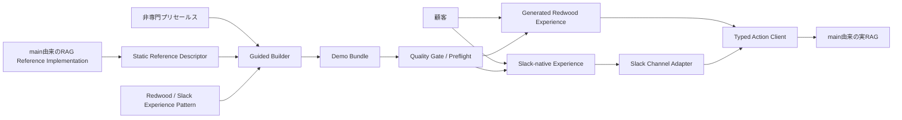
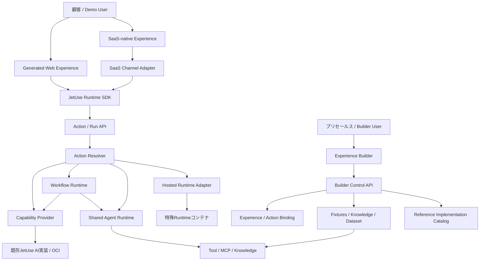

# JetUse Experience Builder — main安定版からの実装方針

日付: 2026-06-30

状態: 実装方針案・今後の設計正本

基準: `main`ブランチ（調査時点 `e3c0726`）

プロダクト全体の目的、利用者、ユースケースは[JetUseプロダクトコンセプト](./jetuse-product-concept.md)を参照。

本書では利用主体を次のように固定する。

- **Builder User**: Experience Builderを使い、顧客向けデモを作成・検証・修正するプリセールスエンジニア
- **Demo User**: 生成されたWeb / SaaS Experienceを使い、AIの社内利用を評価する顧客

顧客がBuilderを直接利用するセルフサービスモデルは初期スコープに含めない。Control Planeはプリセールスエンジニア向け、Experience Planeは顧客向けとして設計する。

本実装の第一仮説は、プラットフォームの再利用性ではなく次である。

> コーディング、AIアーキテクチャ、UI設計に詳しくないプリセールスエンジニアが、JetUseに実装済みのリファレンス実装を正しく利用し、顧客が見た目・触り心地・業務適合性を評価できるWeb / SaaSデモを完成し、案件をフィジビリティ検証へ進められる。

再利用率、作成時間、Capability数は副次指標とする。第一仮説が実証される前に、汎用Catalog、Workflow Runtime、Hosted Runtime、Marketplaceを作り込まない。

## 1. 結論

JetUseの次期構想は、`main`にある「OCI上のAI機能カットの安定したデモ集」を捨てず、次の3層へ再構成する。

1. **JetUse AI Runtime**
   - RAG、Agent、OCR、NL2SQL、音声、要約などのリファレンス実装を提供する。
   - 顧客ごとのUIから利用できる、共通の実行契約を提供する。
2. **JetUse Experience Builder**
   - プリセールスエンジニアが、顧客固有の画面、業務用語、画面遷移、表示データ、SaaSメッセージ、Action Mappingを生成する。
   - 生成物はJetUse AI Runtimeだけを利用し、OCIサービスやSaaS APIを直接呼ばない。
3. **Experience Channels**
   - Redwood Web ExperienceとSaaS-native Experienceを提供する。
   - Slackを最初のReference Integrationとし、Web詳細画面と組み合わせたHybrid Experienceを作る。

バックエンドの基本アーキテクチャは固定する。一方、機能の表現力を失わないため、すべてを単純な共通処理へ押し込めず、実行対象を次の4種類に分ける。

- **Capability**: RAG、OCR、分類などの単機能
- **Workflow**: 複数のCapabilityやToolを組み合わせた処理フロー
- **Agent**: 状況に応じてToolやKnowledgeを選択する実行定義
- **Hosted Runtime**: 共通ランタイムでは実現できない特殊実装

長期的にはWeb UIとSaaS Channel Adapterから、4種類すべてを共通の**Action / Run API**で呼び出す。MVPでは`main`由来の実RAG 1つを、具体的な型付きActionから利用する。

JetUseが保証するのは、実装済みReference Implementationを正しく使い、デモで確認した範囲と制約を説明できる**Demo Validity**である。顧客固有の性能、可用性、セキュリティ、運用、連携まで含む**Solution Validity**は、案件確度が上がった後に専任チームが検証する。

`main`はv1安定版として維持し、次期実装は`main`から分岐した専用の統合ブランチで進める。現在の実験ブランチのコードを土台にはせず、得られた知見だけを設計へ持ち込む。

## 2. この方針で実現したいこと

同じRAGやAgentのバックエンドを利用しながら、顧客ごとに次を変えられる状態を目指す。

- アプリの情報設計とナビゲーション
- 画面、カード、テーブル、ダッシュボード
- 顧客の業務用語
- 表示項目と操作フロー
- 顧客から受領、またはAIで生成したデモデータ
- RAGに投入する文書
- Workflowの処理順序と分岐
- AgentのInstructions、Tool、Knowledge、出力形式
- AI結果の見せ方
- Web / SaaS-native / HybridのExperience Channel
- Slackメッセージ、操作、通知先、Web詳細画面への遷移

例えば同じ`rag.answer`を使っても、製造業の保守受付、医療機器サポート、社内規程ヘルプデスクでは、UI、データ、Workflowを別物として生成する。

成功の判定基準は、「プリセールスエンジニアがバックエンドコードを変更せず、実装済みReference Implementationから顧客固有の高品質なUI/UXを生成し、顧客がWebまたはSaaS上で操作・評価し、次のフィジビリティ検証項目を具体化できること」とする。

特に、従来は専門チームや熟練者の支援がなければデモを作れなかった対象者が、開発者の直接介入なしで品質基準を満たせるかを最初に評価する。

## 3. 守る設計原則

### 3.1 共通化するのは実行契約

共通APIを「任意のJSONを受け取り、テキストを返す1つのエンドポイント」にはしない。

共通化するものは次である。

- 実行開始
- ストリーミングイベント
- 状態取得
- 中断、キャンセル
- 人間入力による再開
- 完了と失敗
- Artifactの返却

Capabilityごとの設定、入力、出力はJSON Schemaで個別に型付けする。

### 3.2 Experience Channelは論理Actionだけを知る

Generated Web UIとSaaS Channel Adapterは`rag.answer`や`agent.run`を直接呼ばず、Experience内の論理Actionを呼ぶ。

```tsx
const answerCustomer = useJetUseAction('answer-customer')
const run = await answerCustomer.start({ question: inquiry.body })
```

ActionがどのCapability、Workflow、Agent、Hosted Runtimeへ接続するかはExperience定義側で決める。

### 3.3 Agent定義とランタイムを分離する

顧客ごとのAgentは設定データとして保存する。Agentごとにコンテナを作らない。

コンテナを追加する単位は、特殊な推論ループやライブラリを実装した**Runtime Provider**とする。同じRuntime Provider上で複数のAgent Definitionを実行できるようにする。

### 3.4 データを用途別に分離する

UIのサンプル表示データ、RAG文書、業務データ、実行状態を同じ入れ物で扱わない。詳細は§9で定義する。

### 3.5 既存AI実装は最初から書き直さない

新設するのは主に外向けAPI、契約、Registry、SDKである。`main`で実機検証済みのAI実装はProvider Adapterから再利用する。

### 3.6 現在のリファレンス実装を製品知識の起点にする

Builderはコーディングエージェントへのプロンプト入力画面ではない。まず`main`に実装済みの機能から、次を機械可読なReference Implementation Descriptorとして持つ。

- Demo Playbook
- 対応するReference Scenario
- 入力、出力、必要データ、制約
- Redwood UI Pattern
- SaaS Channel Pattern
- Demo Validityとデモ品質のQuality Gate
- デモ台本、想定質問、フォールバック

Builderは顧客要件からこれらを選び、生成し、検証結果と理由をプリセールスエンジニアへ説明する。対応できる実装がない場合は新規バックエンドを生成せず、専任チームへの引き継ぎ候補とする。専任チームの知見が蓄積された後、新しいReference ImplementationとExpert Knowledge Extensionを追加する。

### 3.7 UI/UXを主要な差別化領域とする

MVPでは自由なReact生成を既定にしない。

1. 検証済みUI Patternを選ぶ。
2. 顧客用語、項目、Fixture、配置を宣言的に変更する。
3. Patternで不足する局所部品だけコード生成する。

顧客用語とデータだけでなく、情報設計、画面遷移、AI結果と引用、人間確認、Streaming / Loading / Empty / Error / Retryを作り込む。これにより、非専門プリセールスが生成コードの良否を自分で判断しなければならない状況を減らし、顧客が自社の将来業務として操作できるExperienceを作る。

### 3.8 品質基準を通らないデモは完成扱いにしない

Build成功だけでは完成としない。実AI接続、代表シナリオ、引用、Streaming / Loading / Empty / Error / Retry、SaaS接続、デモ台本、フォールバックを確認し、Quality Gateとプリセールスの最終確認を通過した版だけをDemo Bundleとして固定する。

### 3.9 SaaS接続は検証済みChannel Adapterを使う

生成コードからSaaS APIを直接呼ばない。最初はSlackの認証、Event受信、Action応答、再送、エラー処理をReference Integrationとして固定し、Builderはメッセージ、データMapping、Action Binding、Web画面への遷移だけを顧客向けに変更する。

## 4. ブランチと製品系列

### 4.1 ブランチ方針

`main`は、現在のAI機能カットデモ集を再現できる安定版として維持する。

次期実装では、`main`から新しい統合ブランチを一度だけ作る。

```text
main                         v1安定版・直接開発しない
  └─ next/experience-builder v2統合ブランチ
       ├─ feat/run-protocol
       ├─ feat/knowledge-space
       ├─ feat/shared-agent-runtime
       ├─ feat/experience-sdk
       └─ feat/builder-worker
```

ブランチ名は仮称だが、役割は次のように固定する。

- `main`: v1デモ集の保守、再デプロイ、緊急修正
- `next/experience-builder`: 次期製品の統合とE2E検証
- `feat/*`: 小さな設計単位の実装

次期構想を`main`へ段階的に混在させない。正式な製品切り替えを決定するまで、`next/experience-builder`を独立した製品系列として扱う。

### 4.2 修正の流れ

- v1固有の不具合は`main`で修正し、必要なら次期ブランチへ取り込む。
- 次期機能は`main`へ逆流させない。
- 現在の実験ブランチは調査材料として残し、次期ブランチへ丸ごとマージしない。
- 実験ブランチから再利用する場合も、設計確定後に必要なコードだけを再実装または限定的に移植する。

## 5. MVPアーキテクチャと将来境界

### 5.1 MVPアーキテクチャ

最初の実証では、PaaS級の抽象を実装しない。`main`の実RAGを1つ、具体的なAction Contractと薄いクライアントで利用する。



MVPでは次を静的またはin-processで実装してよい。

- Reference Implementation一覧: リポジトリ内の静的Descriptor
- Action解決: 単純な対応表
- Runtime SDK: `answer.with-citations@1`専用の薄い型付きクライアント
- Web UI: 制約されたRedwood Experience Pattern
- SaaS: Slack Reference Integrationと制約されたMessage / Action Mapping
- データ: 案件単位のFixtureとKnowledge

汎用サービスとしてのCatalog、Resolver、Workflow Runtime、Hosted Runtimeは、必要性が実証されるまで実装しない。

### 5.2 長期的な拡張境界

以下は第一仮説が成立した後の目標境界であり、MVPの実装一覧ではない。



アーキテクチャを次の4面に分ける。

| 面 | 責務 |
|---|---|
| Experience Plane | 顧客が利用するデモUI、表示データ、画面遷移、Action利用 |
| Control Plane | プリセールスエンジニアによるExperience、Action Binding、Agent、Workflow、Knowledgeの作成・更新 |
| Execution Plane | Runの開始、イベント配信、再開、完了、失敗 |
| Provider Plane | RAG、Agent、OCR、Workflow、Hosted Runtimeなどの実体 |

この4面は依存方向を説明する概念モデルとして利用する。各面を独立サービスとして先に構築することは意味しない。

## 6. 中心となるドメインモデル

| モデル | 意味 |
|---|---|
| `Experience` | 顧客別Web / SaaS UIとその構成 |
| `ReferenceImplementationDescriptor` | 実装済みAI機能・SaaS接続の対応シナリオ、契約、制約、テスト |
| `ExperienceChannel` | Web、SaaS-native、Hybridの提供面 |
| `ChannelBinding` | SaaS Event / ActionとJetUse Actionの対応 |
| `ActionBinding` | UI上の論理Actionと実行対象の対応 |
| `CapabilityDescriptor` | 単機能AIの設定・入出力・実行方式 |
| `WorkflowDefinition` | ノードと接続で表す決定的な処理フロー |
| `AgentDefinition` | Instructions、Tools、Knowledge、モデル、出力契約 |
| `RuntimeProvider` | Capability、Agent、Workflowを実行する実装 |
| `Run` | 1回の実行とその状態 |
| `RunEvent` | Run中に発生したメッセージ、検索、Tool、承認、結果 |
| `KnowledgeSpace` | RAG対象文書と索引の論理単位 |
| `Dataset` | NL2SQLや業務Toolで扱う構造化データ |
| `FixtureSet` | UI表示用のデモデータ |
| `Artifact` | 生成文書、画像、音声、表、ファイルなどの成果物 |
| `DemoEvidencePack` | 動作した構成、顧客確認事項、制約、未検証事項、引き継ぎ情報 |

### 6.1 ExperienceとAction Binding

```yaml
apiVersion: jetuse.oracle.com/v1alpha1
kind: Experience

metadata:
  name: medical-device-support
  title: 医療機器お問い合わせ管理

ui:
  package: medical-device-support-ui
  designSystem: jetuse-redwood
  entryRoute: inbox

channels:
  web:
    enabled: true
  slack:
    adapter: slack-reference@1
    messagePattern: answer-with-citations
    detailRoute: /inquiries/{inquiryId}

resources:
  fixtures:
    inquiries: medical-inquiries-v1
  knowledge:
    manuals: medical-device-manuals-v3

actions:
  answer-customer:
    target:
      kind: workflow
      ref: support-answer-workflow@1
    bindings:
      knowledge: manuals

  investigate-issue:
    target:
      kind: agent
      ref: technical-support-agent@2
```

Generated Web UIとSlack Channel Adapterは`answer-customer`と`investigate-issue`だけを参照する。ターゲットの変更や版更新で各チャネルを書き換えない。

## 7. API設計

### 7.1 Reference Implementation Descriptor / Catalog API

Builderとコーディングエージェントが、利用可能な実装、対応シナリオ、Experience Channel、制約を発見するための契約である。MVPではリポジトリ内の静的Descriptorとし、Catalog APIはGate成立後にサービス化する。

```text
GET /api/v1/catalog/capabilities
GET /api/v1/catalog/capabilities/{id}/versions/{version}
GET /api/v1/catalog/reference-integrations
GET /api/v1/catalog/workflow-nodes
GET /api/v1/catalog/runtime-providers
```

Capability Descriptorは最低限、次を持つ。

```yaml
id: rag.answer
version: 1.0.0
displayName: 引用付きRAG回答
executionMode: stream

configSchema:
  # Builderが設定するknowledge、retrieval profileなど

inputSchema:
  # UIが実行時に渡すquestionなど

outputSchema:
  # answer、citationsなど

eventSchema:
  # message.delta、retrieval.completedなど

examples:
  - name: 製品FAQへの回答
    input:
      question: 保証期間を教えてください

supportedScenarios:
  - support-answer-with-citations

experienceChannels:
  - web
  - slack

limitations:
  - 本番性能、可用性、顧客固有の検索精度は未検証

handoffTriggers:
  - 顧客固有システムとの本番連携
  - 非機能要件を含む構成判断
```

`configSchema`と`inputSchema`を分ける。Knowledge SpaceやAgent設定はBuilderが束縛し、生成UIには毎回指定させない。

### 7.2 Builder Control API

```text
POST /api/v1/experiences
GET  /api/v1/experiences/{experienceId}
PUT  /api/v1/experiences/{experienceId}/definition
PUT  /api/v1/experiences/{experienceId}/actions/{actionId}
POST /api/v1/experiences/{experienceId}/versions

POST /api/v1/workflows
PUT  /api/v1/workflows/{workflowId}
POST /api/v1/agents
PUT  /api/v1/agents/{agentId}
```

プリセールスエンジニアがBuilder経由で利用する。顧客向け生成UIはControl APIで構成を変更しない。

### 7.3 Resource API

```text
POST /api/v1/fixture-sets
POST /api/v1/datasets

POST /api/v1/knowledge-spaces
POST /api/v1/knowledge-spaces/{id}/documents
POST /api/v1/knowledge-spaces/{id}/index-jobs
GET  /api/v1/knowledge-spaces/{id}/index-jobs/{jobId}
POST /api/v1/knowledge-spaces/{id}/query-tests
POST /api/v1/knowledge-spaces/{id}/versions
```

顧客から受領したデータとAI生成データは、同じResource APIへ投入する。

### 7.4 Action / Run API

Capability、Workflow、Agent、Hosted Runtimeを同じRunとして実行する。

```text
POST   /api/v1/experiences/{experienceId}/actions/{actionId}/runs
GET    /api/v1/runs/{runId}
GET    /api/v1/runs/{runId}/events
POST   /api/v1/runs/{runId}/input
POST   /api/v1/runs/{runId}/cancel
GET    /api/v1/runs/{runId}/artifacts
```

標準イベント語彙は次とする。

```text
run.started
message.delta
retrieval.started
retrieval.completed
tool.started
tool.completed
approval.required
artifact.created
run.completed
run.failed
run.cancelled
```

標準イベントは実行状況を表す。Capability固有のデータは、Descriptorの`eventSchema`または完了時の`outputSchema`で表す。

### 7.5 Experience Channel Adapter

SaaS Channel Adapterは、SaaS固有のEvent / ActionとJetUse Action / Runを相互変換する。最初の実装はSlackに限定する。

```text
Slack Event / User Action
  → Slack Reference Adapter
  → Experienceのanswer-customer Action
  → answer.with-citations@1
  → Slack Message / Error / Web Detail Link
```

Adapterが固定するもの:

- 認証と接続方式
- Event受信と検証
- 再送、重複排除、エラー処理
- JetUse Action / Runへの変換
- SaaS-nativeな応答の基本構造

Builderが変更できるもの:

- 顧客用語とメッセージ文言
- 表示する項目と引用
- SaaS Eventと論理ActionのMapping
- 通知先とWeb詳細画面への遷移

生成コードからSaaS APIを直接呼ぶことは禁止する。

## 8. Capability Provider

### 8.1 Providerインターフェース

概念上の最小インターフェースを次とする。

```python
class CapabilityProvider(Protocol):
    descriptor: CapabilityDescriptor

    async def start(self, context: RunContext, input: dict) -> RunHandle:
        ...

    async def resume(self, context: RunContext, user_input: dict) -> None:
        ...

    async def cancel(self, context: RunContext) -> None:
        ...
```

同期処理、ストリーム、長時間ジョブの差はProvider内部とRunイベントで吸収する。

### 8.2 初期Capability

`main`の機能カットは、将来次のCapabilityまたはWorkflowとして公開できる。ただしMVPで一括公開せず、最初は`rag.answer`だけをReference Implementationとする。他の機能は、入出力、制約、UI/UX、テストを定義してから順次追加する。

| `main`の機能 | 新しい実行対象 | 種類 |
|---|---|---|
| 通常チャット | `chat.respond` | Capability |
| RAG回答 | `rag.answer` | Capability |
| エージェント | `agent.run` | Agent Runtime |
| OCR | `document.extract` | Capability |
| 翻訳 | `text.translate` | Capability |
| NL2SQL生成・実行・チャート | `data.ask` | Workflow |
| 議事録 | `meeting.process` | Workflow / Job |
| STT | `speech.transcribe` | Capability / Stream |
| TTS | `speech.synthesize` | Capability |

特にNL2SQLは、生成UIへ「SQL生成→実行→チャート提案」を個別に実装させず、`data.ask` WorkflowとしてJetUse側で完結させる。

### 8.3 Provider追加の単位

```text
packages/api/jetuse_platform/providers/
  rag_answer/
    descriptor.yaml
    provider.py
    schemas.py
    examples/
    tests/

  document_extract/
    descriptor.yaml
    provider.py
    schemas.py
    examples/
    tests/
```

新しいReference Implementationを追加する手順を固定する。追加候補は、専任チームの案件知見、または`main`での実機検証から得る。

1. 複数案件で再利用する価値と、JetUseで保証するDemo Validityの範囲を確認する。
2. OCI上のシンプルなReference ArchitectureとしてProviderを実装・実機検証する。
3. 設定、入力、出力、イベントSchema、既知の制約を定義する。
4. Web / SaaS Experience Pattern、想定質問、デモ台本を追加する。
5. Provider contract test、E2E、Preflightを通す。
6. Reference Implementation DescriptorとVersionをRegistryへ登録する。

Registry登録後はCatalogへ現れ、BuilderとExperience Channelから利用できるようにする。専任チームの知見を文書だけで追加せず、動作するReference Implementationと検証資産へ落とせたものだけをBuilderの選択肢にする。

## 9. データ設計

### 9.1 FixtureSet

顧客仕様の画面を見せるためのデモデータである。

- 問い合わせ
- 顧客
- 製品
- 契約
- 案件
- KPI

Experienceの表示用であり、RAG文書と混同しない。JSONまたは構造化テーブルとして保持し、Entity Schemaと関連を持てるようにする。

### 9.2 KnowledgeSpace

RAGとAgentが参照する知識データである。

- 顧客から受領した文書
- 顧客Webサイトから許可を得て取得した文書
- AIで生成したデモ用マニュアルやFAQ
- 既存の製品資料

Knowledge Spaceは次のライフサイクルを持つ。

```text
作成
  → 文書投入
  → パース・チャンク化
  → インデックス
  → 検索テスト
  → Version作成
  → Workflow / Agentへ束縛
```

RAG実装はRetriever Providerで交換可能にする。

```text
KnowledgeSpace
  └─ Retriever Contract
       ├─ OCI Vector Store
       ├─ Select AI RAG
       ├─ OpenSearch
       └─ External Knowledge API
```

ExperienceはKnowledge Spaceの論理名または固定Versionを参照する。文書の追加やRetriever変更でUIを再生成しない。

### 9.3 Dataset

NL2SQLや業務Toolが扱う構造化データである。FixtureSetをDatasetへ昇格させることはできるが、表示用データと実行対象データは明示的に区別する。

### 9.4 Runtime State

次は顧客提供データとは別に保存する。

- Conversation
- Agent Memory
- Workflow Run
- Tool Result
- 承認待ち状態
- Artifact

### 9.5 顧客データの取り扱い

本書では詳細なデータガバナンスを別設計とするが、実顧客データを利用する前に次を必須契約として定める。

- 保管場所とアクセス主体
- 案件または顧客単位の分離
- 顧客受領データとAI生成データのProvenance
- 保持期限と商談終了後の削除
- Demo Bundle削除後に残る索引、Run、Artifactの扱い

顧客文書とAI生成文書は同じResource APIへ投入できても、由来、保持期限、削除状態を同一視しない。

## 10. AgentとWorkflow

### 10.1 Shared Agent Runtime

通常のAgentは共通ランタイムで実行する。

Agent Definitionで変更可能にするものは次である。

- Instructions
- モデル
- Tool / MCP
- Knowledge Space
- 入出力Schema
- 会話とメモリ
- 最大ステップ数
- 終了条件
- 人間確認ポイント

Agent Definitionは設定データであり、作成や更新にコンテナデプロイを伴わない。

### 10.2 Workflow Runtime

MVPで対応するノードを次に限定する。

- Input / Output
- Capability
- LLM / Prompt Template
- Knowledge Retrieval
- Agent
- Tool / MCP
- Transform / Template
- If / Else
- Parallel
- Iteration
- Human Input / Approval

Difyと同等のビジュアルキャンバスは初期目標にしない。コーディングエージェントがWorkflow Definitionを生成し、プリセールスエンジニアには処理ステップ、分岐、使用データ、Tool、確認ポイントを構造化表示する。顧客向けデモには、業務上必要な進捗・確認・結果だけを表示する。

### 10.3 Hosted Runtime

共有ランタイムで扱えない場合だけ、Runtime Providerコンテナを追加する。

対象例:

- 独自のマルチエージェント制御
- 特殊ライブラリ
- 長時間の状態機械
- 独自プロトコル
- 特殊な推論アルゴリズム

Hosted RuntimeはJetUse Run Protocolを実装し、Action Resolverから見ると他の実行対象と同じにする。

```text
Runtimeコンテナ1個
  ├─ Agent Definition A
  ├─ Agent Definition B
  └─ Agent Definition C
```

顧客またはAgent Definitionごとにコンテナを作る方式を既定にしない。

## 11. Experience Channels

### 11.1 Generated Web Experience契約

生成UIは安定したJetUse Shell内で動作するアプリパッケージとする。

```text
experience-package/
  experience.yaml
  src/
    App.tsx
    pages/
    components/
  fixtures/
  tests/
```

生成コードが利用できる主要パッケージを固定する。

- `@jetuse/ui`: RedwoodトークンとUIコンポーネント
- `@jetuse/runtime-sdk`: Action、Run、Artifact、Resourceアクセス
- `@jetuse/experience`: Routing、Context、Fixture、Binding

生成UIは生のAPI URLを持たない。`fetch('/api/chat/stream')`のような呼び出しは禁止し、Runtime SDKだけを利用する。

### 11.2 Builderの生成ループ

```text
プリセールスエンジニアによる顧客要件の入力
  → 実装済みReference Scenario推薦
  → Web / SaaS-native / Hybrid Channel選択
  → Experience Blueprint
  → Fixture / Knowledge / Dataset準備
  → AI Action選択
  → Redwood UI Pattern構成
  → SaaS Message / Action Mapping構成
  → 必要な場合だけ局所コード生成
  → TypeScript Build
  → Component Test
  → Technical / Scenario Gate
  → ブラウザ描画
  → スクリーンショット確認
  → 修正
  → Preflight
  → Demo Bundle固定
```

コーディングエージェントへ渡すものは次に限定する。

- Experience Blueprint
- 顧客の業務説明と画面要件
- Fixture Schemaとサンプルデータ
- 利用可能なActionとReference Implementation Descriptor
- Runtime SDKの型と使用例
- Redwood Experience Kit
- 検証済みSaaS Channel Pattern
- 良い画面の実装例
- ビルド、テスト、スクリーンショット取得方法
- Demo Playbook、想定質問、技術・顧客訴求力の評価基準

エージェントはJetUseのAIバックエンド実装を編集しない。

### 11.3 SaaS-native / Hybrid Experience

SaaS-native ExperienceではSaaS自身のUI作法を尊重し、Redwoodの見た目をSaaSへ持ち込まない。Slackでは質問、回答、引用、簡単な確認・承認を自然なメッセージ操作として提供する。

複雑な一覧、詳細、比較、編集、Artifact表示はGenerated Redwood UIへ遷移する。WebとSaaSを別アプリとして生成せず、同じExperience、Action Binding、Fixture、Knowledge、Demo Evidenceを共有する。

## 12. `main`からの移行方針

### 12.1 現在のAPIの位置づけ

`main`のAPIはデモ画面ごとに設計されている。

- `/api/chat/stream`は通常チャット、RAG、Agent、画像、Tool、承認状態を多くのフラグで切り替える。
- NL2SQLはSQL生成、実行、チャート提案を複数APIとしてUIが組み立てる。
- 議事録は作成、状態取得、生成を画面がオーケストレーションする。
- OCR、翻訳、TTSは個別の同期APIである。

これらを生成UIへ直接公開する契約にはしない。

### 12.2 再利用するもの

`main`の次の実装は原則として再利用する。

- OCI Generative AIクライアント
- Chat / RAG / Agentの実行ロジック
- OCI Vector Store、Select AI、OpenSearch連携
- NL2SQLの生成、検証、読取実行
- OCR、Speech、TTS
- Conversation、Dataset、MinutesのRepository
- OCIインフラとデプロイ構成
- Redwoodデザイントークンと既存UI部品

### 12.3 新設または書き直すもの

- RAG Reference Implementation Descriptor
- `answer.with-citations@1`の薄い型付きAction Client
- Redwood Experience PatternとVisual Quality Gate
- Experience定義、Demo Bundle、Demo Evidence Pack
- Slack Reference Channel AdapterとMessage / Action Pattern
- Guided BuilderとBuilder Worker

次はGate成立後に必要性を確認して新設する。

- `/api/v1`のCatalog、Control、Resource、Run API
- Capability / Workflow / Agent Registry
- Provider Adapter
- RunとEventの永続化、ストリーム
- Knowledge Spaceの抽象化
- Experience定義とAction Binding
- TypeScript Runtime SDK
- Experience ShellとUIパッケージローダー

### 12.4 段階移行

次期ブランチでは、当面既存APIと`/api/v1`を並存させる。

1. Provider Adapterから既存`jetuse_core`関数を直接呼ぶ。
2. 新しいAPIから既存HTTPルートを内部呼び出ししない。
3. 新しい手書きのリファレンスExperienceをRuntime SDKだけで実装する。
4. 既存JetUse UIの移行は、新しい縦切り動作が安定してから行う。
5. 旧APIの廃止は、Builder生成UIが必要機能を網羅した後に判断する。

API層は新設計として扱うが、AI実装まで一括リライトしない。

## 13. 推奨ディレクトリ構成

概念上、次の責務分離を目指す。

```text
packages/
  api/
    jetuse_core/                 # main由来のAI実装
    jetuse_platform/             # 次期プラットフォーム層
      contracts/
      catalog/
      control/
      resources/
      runtime/
      workflows/
      agents/
      providers/
      reference_descriptors/
      channels/
        slack/
    service/routes/v1/

  runtime-sdk/                   # TypeScript SDK
  ui-kit/                        # JetUse Redwood Experience Kit
  experience-shell/              # 生成UIのホスト
  builder-worker/                # コーディングエージェント連携

examples/
  experiences/                   # 手書き・生成のリファレンスExperience
```

最初から物理パッケージをすべて分割する必要はないが、依存方向は次を守る。

```text
Generated Web UI / SaaS Channel Adapter
  → Typed Action Client / Runtime SDK
    → /api/v1 Run API
      → jetuse_platform
        → Provider Adapter
          → jetuse_core / OCI
```

逆方向の依存を作らない。

## 14. 実証Gateと実装フェーズ

機能を順番に作る前に、非専門プリセールスの能力向上をGateで証明する。

### Gate 0: ベースラインと評価設計

実施内容:

- 対象プリセールスのスキル条件を定義する。
- `main`のReference Implementation、API、制約、実機確認結果を棚卸しする。
- 熟練者＋Codex等、非専門者＋共有テンプレートの現状値を測る。
- Demo Validity、UI/UX、Customer Resonance、Demo Reliabilityの採点基準を作る。
- 専門家レビューを、作成者を伏せたブラインド方式で実施できるようにする。

完了条件:

- Demo Enablement RateとQuality Gapを算出できる。
- JetUse有無を比較できる共通課題、データ、制限時間、評価表がある。

### Gate 1: 引用付きRAGのReference-Guided Web Experience

実施内容:

- `answer.with-citations@1`を1つだけ定義する。
- `main`の実RAGを薄くAdapter化する。
- RAG Reference Implementation Descriptorと問い合わせ対応用Demo Playbookを作る。
- Inbox + Detail、Answer + CitationsのUI Patternを作る。
- Fixture / Knowledge生成、Preflight、デモ台本を実装する。

完了条件:

- 対象プリセールスがコードを編集せず、顧客別デモを準備できる。
- 実RAG、引用、エラー時表示を含むDemo Bundleを固定できる。

### Gate 2: 非専門プリセールスによるデモ完遂

実施内容:

- 対象プリセールスに同一条件でBuilderを利用してもらう。
- 評価期間中はReference Implementationとの整合をブラインドレビューする。
- 顧客または顧客役が、業務適合性と魅力を評価する。
- 必要だった専門家介入、コード修正、デモ前修復を計測する。

完了条件:

- 事前に定めたDemo Enablement Rateを満たす。
- 非専門者＋JetUseのQuality Gapが許容範囲に入る。
- 顧客セッションをBuilder操作なしで完遂できる。

### Gate 3: Slackを使ったHybrid Experience

実施内容:

- Slack Reference Adapterを実装する。
- Slack Eventから`answer-customer`を開始し、回答、引用、エラーを返す。
- Slackの詳細リンクからGenerated Redwood UIへ遷移する。
- Builderでメッセージ、Action Mapping、顧客データを変更できるようにする。
- 顧客評価から次のフィジビリティ検証項目をDemo Evidence Packへ記録する。

完了条件:

- WebとSlackが同じRAG Action、Fixture、Knowledgeを共有する。
- プリセールスエンジニアがSaaS APIコードを変更せず顧客別に構成できる。
- 顧客が普段の業務接点として操作し、次の検証項目を具体化できる。

### Gate 4: 別業種への一般化

実施内容:

- 同じRAGとAction Contractを、製造保守と医療機器サポートなど2業種へ適用する。
- 2件目に必要だった新規作業、専門家介入、再利用資産を計測する。

完了条件:

- 技術品質を落とさず別業種へ適用できる。
- 変更が主にPlaybook、UI Pattern構成、Fixture、Knowledgeへ閉じる。

Phase 0はGate 1の準備として先に行う。Phase 1以降の汎用化はGate 2〜4の成立後に着手を判断する。Gateを満たさない場合は、汎用基盤を拡張せず、Reference Descriptor、UI/UX、Channel Pattern、Quality Gateの改善を優先する。

### Phase 0: ベースラインと契約確定

実施内容:

- `main`から次期統合ブランチを作成する。
- `main`のAPI、E2E、実機結果をベースラインとして固定する。
- 本書をADRとAPI仕様へ分割する。
- MVPに必要なExperience、Demo Bundle、RAG Action、Knowledge参照の最小Schemaを確定する。

完了条件:

- OpenAPIまたはJSON Schemaで主要契約をレビューできる。
- 既存テストが次期ブランチでも変更なしで通る。

### Phase 1: Run ProtocolとCatalog

実施内容:

- Run、RunEvent、Artifactのモデルを実装する。
- Catalog APIとProvider Registryを実装する。
- Runtime SDKの最小クライアントを作る。
- `text.translate`など単純なCapabilityを1本Adapter化する。

完了条件:

- 手書きUIからActionを開始し、Run完了まで取得できる。
- Capability DescriptorからTypeScript型を生成できる。

### Phase 2: 代表的な3方式の縦切り

対象:

- `rag.answer`: ストリーミングと引用
- `agent.run`: Toolイベントと人間入力による再開
- `document.extract`: ファイル入力と構造化JSON

完了条件:

- 3方式を同じRuntime SDKで利用できる。
- 生成UIが既存API URLを知らずに動く。

### Phase 3: Resource Plane

実施内容:

- FixtureSet、KnowledgeSpace、Datasetを実装する。
- 顧客データとAI生成データの投入経路を統一する。
- Knowledge Spaceの索引ジョブ、検索テスト、Versionを実装する。
- RAG Providerを最低2方式で差し替えられるようにする。

完了条件:

- Knowledge Spaceを差し替えてもUIを再ビルドせずRAG結果が変わる。
- 同じExperienceを異なるFixtureSetで表示できる。

### Phase 4: Shared Workflow / Agent Runtime

実施内容:

- MVPノードを持つWorkflow Runtimeを実装する。
- Agent Definitionを共有ランタイムで実行する。
- WorkflowとAgentをActionへ束縛する。
- Runの中断、再開、Tool、Approvalイベントを統一する。

完了条件:

- RAG→条件分岐→Agent→人間確認のWorkflowが動く。
- Agent Definitionの作成・変更にコンテナ再配備が不要である。

### Phase 5: Experience SDKと手書きリファレンスUI/UX

実施内容:

- `@jetuse/ui`と`@jetuse/runtime-sdk`を確定する。
- Experience Shellとパッケージローダーを実装する。
- 業界の異なる3つのUIをまず人手で作る。
- SaaS-native操作とWeb詳細画面をつなぐReference Experienceを整備する。

候補:

- 製造業の保守問い合わせ
- 医療機器サポート
- 社内規程ヘルプデスク

完了条件:

- 3つのUIが同じRAG / Agentバックエンドを利用する。
- UI、Fixture、Channel表現だけで顧客固有のプロトタイプに見える。

### Phase 6: プリセールス向けExperience Builderとコーディングエージェント

実施内容:

- プリセールスエンジニアが入力した顧客ヒアリング結果からExperience Blueprintを生成する。
- Fixture、Knowledge準備、許可されたWorkflow / Agent設定の生成を追加する。
- UIパッケージを生成する。
- SaaS Message / Action Mappingを生成する。
- Build、Test、ブラウザ、スクリーンショット、修復のループを実装する。

完了条件:

- 手書きリファレンスUIと同等の品質を、同じ契約から生成できる。
- プリセールスエンジニアが、顧客用語、データ項目、画面構成の変更を自然言語で反映できる。
- 顧客は生成されたWeb / SaaS Experienceだけを利用し、Builder機能へアクセスしなくてもデモを完遂できる。

### Phase 7: Hosted Runtime拡張

実施内容:

- 外部Runtime向けの内部Run Protocolを確定する。
- 特殊Runtimeコンテナを1つ実装する。
- Shared RuntimeとHosted Runtimeを同じAction APIから呼ぶ。

完了条件:

- UIコードを変更せず、Action BindingだけでShared / Hostedを切り替えられる。
- 1つのHosted Runtimeで複数のAgent Definitionを実行できる。

## 15. MVPの範囲

最初のMVPは、Difyの完全な代替を目指さない。

MVPに含める:

- 引用付きRAG問い合わせ対応1ユースケース
- `main`由来の実RAG
- RAG Reference Implementation Descriptor
- `answer.with-citations@1`の具体的なAction Contract
- 問い合わせ対応Demo Playbook
- 制約されたRedwood Experience Pattern
- Slack Reference Integration
- Slackの質問・回答・引用・エラー・Web詳細遷移
- 顧客別FixtureとKnowledge
- Guided Builder
- Demo Validity、UI/UX、顧客訴求力、デモ信頼性のQuality Gate
- Preflight、デモ台本、フォールバック
- Demo Evidence Packと専任チームへの引き継ぎ情報
- 非専門プリセールスを対象にした評価

MVPに含めない:

- 汎用Capability Catalogサービス
- 汎用Action Resolverサービス
- 汎用Workflow Runtime
- Agent / OCR / NL2SQLの網羅
- Hosted Runtimeの実装
- Marketplace
- Slack以外のSaaS Reference Integration
- 任意SaaS Connectorの動的生成
- Dify相当の汎用ビジュアルキャンバス
- 任意Python / JavaScriptコードノード
- 顧客ごとの専用インフラ自動構築
- Agent Definitionごとのコンテナデプロイ
- コーディングエージェントによるAIバックエンドコード生成
- 生成UIからOCI SDKや既存個別APIへの直接アクセス
- 顧客が直接利用するセルフサービスBuilder

## 16. 受け入れ基準

### 16.1 アーキテクチャ

- Generated Web UIはRuntime SDK以外からAI機能を呼ばない。
- Slack Experienceは検証済みChannel Adapter以外からSaaS APIを呼ばない。
- WebとSlackが同じ`answer-customer` ActionとRAG実装を利用する。
- Action Bindingの変更だけで実行対象を切り替えられる。
- 顧客別Experience生成でAIバックエンドコードを変更しない。
- 汎用Capability、Agent、Hosted Runtimeの可換性はGate成立後の受け入れ基準とする。

### 16.2 データ

- UI FixtureとKnowledge Spaceを独立して更新できる。
- 顧客文書とAI生成文書を同じ投入経路で処理できる。
- 顧客受領データとAI生成データの由来、保持期限、削除状態を区別できる。
- Knowledge SpaceのVersionを固定してプロトタイプを再現できる。
- Datasetを差し替えてもUIコードを再生成しない。

### 16.3 Experience / UI・UX

- 同じRAGを使い、顧客固有のWeb Experienceを作れる。
- プリセールスエンジニアが顧客の用語、項目、データ、画面遷移を変更できる。
- 生成UIがJetUseのRedwoodデザインと一貫する。
- Build、型検査、UIテスト、ブラウザ描画を自動確認できる。
- Streaming、Loading、Empty、Error、Retryを確認できる。
- Slackから質問し、回答・引用を受け取り、Web詳細へ遷移できる。
- 顧客がBuilderを操作せず、Web / SaaS Experienceだけでデモを利用できる。

### 16.4 Enablement

- 対象プリセールスのDemo Enablement Rateを計測できる。
- 開発者・専門家の介入時間を記録できる。
- 熟練者が同じReference Implementationから作ったデモとのQuality Gapを評価できる。
- Demo Validityと顧客訴求力の両方を満たした場合だけ完成扱いにする。
- Feasibility Progression Rateと、合意した次の検証項目を記録できる。

### 16.5 専任チームへの引き継ぎ

- Demo Evidence Packに、動作したReference ImplementationとVersionを記録する。
- 実接続とシミュレーション、確認済み事項と未検証事項を区別する。
- 顧客が評価したUI、操作、データ、追加要件を引き継げる。
- Solution Validityが必要な要求をJetUse内で自動実装せず、専任チームへ渡す。

### 16.6 後方互換

- 次期ブランチ上でも、移行期間中は`main`由来の既存デモが動作する。
- 既存AIロジックをProvider化する際、現在の実機結果との回帰比較を行う。

## 17. 最初に作成する設計成果物

実装開始前に次を作成する。

1. 対象プリセールスペルソナと除外スキル
2. `main`のReference Implementation棚卸し
3. Demo Enablement Rate / Feasibility Progression Rate / Quality Gap評価プロトコル
4. 問い合わせ対応Demo Playbook
5. RAG Reference Implementation Descriptor
6. Inbox + Detail / Answer + Citations UI Pattern
7. Slack Message / Action / Web遷移Pattern
8. Demo Validity評価表
9. Customer Resonance / UI・UX評価表
10. Demo Reliability / Preflightチェックリスト
11. JSON Schema: Demo Bundle / Experience / Demo Evidence Pack
12. JSON Schema: `answer.with-citations@1`
13. TypeScript: 最小Action Client
14. RAG Adapter contract test
15. Slack Channel Adapter contract test

Gate成立後に、汎用Capability Descriptor、Workflow / Agent Definition、Catalog / Control / Run APIのADR・Schemaを作成する。

## 18. 参考

- `main:packages/api/service/routes/chat.py` — 現在のChat / RAG / Agent統合ルート
- `main:packages/api/service/routes/dbchat.py` — 現在のNL2SQL分割API
- `main:packages/api/service/routes/minutes.py` — 現在の長時間処理
- `main:packages/api/service/routes/voice.py` — OCR、翻訳、音声Capability候補
- `main:packages/api/jetuse_core/` — 再利用するAIリファレンス実装
- [Dify plugin extension points](https://docs.dify.ai/en/develop-plugin/getting-started/choose-plugin-type)
- [Dify workflow example](https://docs.dify.ai/en/use-dify/tutorials/workflow-101/lesson-07)
- [Dify Knowledge Base API](https://docs.dify.ai/api-reference/knowledge-bases/get-knowledge-base)
