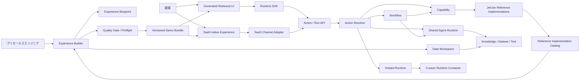

# JetUse プロダクトコンセプト

日付: 2026-06-30

状態: プロダクト構想・全体説明の正本

## 1. JetUseとは

JetUseは、**コーディング、AIアーキテクチャ、UI設計の専門スキルを持たないプリセールスエンジニアでも、JetUseに実装済みのOCI AIリファレンス実装を使い、顧客の業務に合った魅力的なUI/UXを持つデモを作れるようにするReference-Guided Experience Builder**である。

JetUseには明確に異なる2つの利用主体がいる。

- **Builderの利用者**: 顧客との商談を担当するプリセールスエンジニア
- **生成されたデモの利用者**: AIの社内利用を検討する顧客の業務担当者・IT担当者・意思決定者

顧客がBuilderを操作して自分でアプリを作ることは、初期のプロダクト前提ではない。プリセールスエンジニアが顧客要件をヒアリングし、Builderを使ってExperienceを準備・検証・修正し、顧客は完成したデモを操作して自社業務への適用可能性を評価する。

JetUseが真に解決する組織課題は、現状では専任チーム、または自らコーディングエージェントやAI実装を学んだ一部のプリセールスエンジニアしか、高品質な顧客別AIデモを作れないことである。JetUseは、まず現在のJetUseにあるリファレンス実装、その入出力、既知の制約、検証手順をReference Implementation Guidanceとして製品へ取り込み、プリセールス組織全体へ展開する。

したがって、作成時間の短縮や案件間の再利用は重要だが、最上位の価値ではない。最上位の価値は、**従来は作れなかったプリセールスエンジニアが、専門家の直接支援なしに、顧客が自社業務として魅力を感じるデモを完成し、案件をフィジビリティ検証へ進められること**である。

JetUseの中心的な考え方は、顧客ごとにAIバックエンドを一から作り直すことではない。

RAG、Agent、OCR、NL2SQL、音声、要約などの共通AI機能は、OCIリファレンスアーキテクチャに沿ったJetUseの実装として維持する。その上に、顧客の業務に合わせたExperienceを生成する。

```text
JetUseのAIリファレンス実装
  × 顧客の業務要件
  × 顧客固有のUI
  × 顧客データまたはデモデータ
  × Workflow / Agent設定
  = 顧客向けAIプロトタイプ
```

JetUseが提供する価値は、AIモデルやRAG方式そのものを顧客ごとに発明することではなく、**信頼できる共通AI機能を、顧客の業務として体験できる形に変換すること**である。

### 1.1 JetUseが扱う技術的妥当性の境界

JetUseでは、技術的妥当性を次の2段階に分ける。

| 区分 | JetUseの責任 | 内容 |
|---|---|---|
| Demo Validity | 対象 | JetUseのリファレンス実装を正しく呼び、実在しない機能を見せず、デモで確認済みの範囲と制約を説明できること |
| Solution Validity | 対象外 | 顧客固有の本番要件、性能、可用性、セキュリティ、運用、既存システム連携まで含めて本番構成の妥当性を判断すること |

JetUseは、プリセールスエンジニアを本番アーキテクトへ変える製品ではない。デモによって顧客の案件確度が上がり、より高い技術的妥当性が必要になった時点で、専任チームがフィジビリティ検証と本番構想を担当する。

現在のリファレンス実装は、蓄積済みの専門知識を完全に形式化したものではない。現時点でOCI上へシンプルに実装する場合の妥当な出発点としてJetUseが実装・検証した構成を正とする。専任チームの案件知見が蓄積された後、新しいリファレンスアーキテクチャとExpert Knowledge Extensionを追加する。

## 2. 一文で表すプロダクト

> JetUseは、コーディングやAIアーキテクチャに詳しくないプリセールスエンジニアでも、実装済みのOCI AIリファレンスを、顧客の業務・データ・利用チャネルに合った魅力的なデモへ変換できるReference-Guided Experience Builderである。

英語での短い表現は次を想定する。

> JetUse enables presales engineers without coding or AI architecture expertise to turn proven OCI AI reference implementations into compelling, customer-specific web and SaaS demo experiences.

## 3. 解決したい問題

### 3.1 高品質なAIデモを作れる人が限られている

顧客に刺さるAIデモには、顧客要件の構造化、AIソリューション設計、UI設計、データ準備、デモ品質の確認が同時に必要になる。

現在これを実行できるのは、次のいずれかに限られる。

- デモ開発の専任チーム
- React、Python、OCI AIを自ら学んだプリセールスエンジニア
- Codex、Claude Codeなどのコーディングエージェントを高度に使える担当者
- 上記の専門家から継続的に支援を受けられる担当者

多くのプリセールスエンジニアは顧客の業務課題を理解し説明する能力を持つ一方、それを技術的に妥当で魅力的な実動デモへ変換する実装能力を持たない。この能力差を埋めることがJetUseの第一目的である。

### 3.2 AI機能よりUI/UXが顧客の評価を左右する

一般的なチャット、RAG、OCR、Agentのデモを見せても、顧客は自社業務へ適用した姿を想像しにくい。

同じRAGでも、顧客が見たいものは「質問欄と回答」だけではない。

- 製造業なら、設備、機種、エラーコード、保守履歴
- 医療機器なら、病院、製品、重要度、問い合わせ履歴
- 法務なら、契約書、条項、リスク、確認状況
- 営業なら、案件、顧客、売上、次のアクション

顧客固有の用語、データ、画面、操作フローがあることで、初めて「自分たちのためのプロトタイプ」に見える。JetUseでは、技術的妥当性をリファレンス実装で担保し、製品投資の重点を次へ置く。

- 顧客業務に合った情報設計と画面遷移
- AI結果、引用、根拠、人間確認の見せ方
- Loading、Streaming、Empty、Error、Retryを含む触り心地
- 顧客が説明なしでも操作できる導線
- デモ当日に止まらない応答とフォールバック

生成UIは営業用の装飾ではない。顧客と将来業務を議論し、次のフィジビリティ検証で確認すべき入力、出力、人間確認、システム連携を具体化するインタラクティブな仕様でもある。

### 3.3 顧客の業務接点はWeb画面だけではない

顧客がAIを適用したい業務は、Slackなど日常利用するSaaS上に存在することが多い。JetUseが生成するWeb画面だけで完結させると、顧客の実際の業務から離れて見える。

JetUseはExperienceの提供先を次の3種類として扱う。

- **Web Experience**: Redwood UIで一覧、詳細、ダッシュボード、レビューを提供する。
- **SaaS-native Experience**: SlackなどのSaaS上で質問、通知、確認、承認を行う。
- **Hybrid Experience**: SaaSで簡易操作を行い、詳細や複雑な操作はRedwood UIへつなぐ。

初期段階では任意のSaaSへ自由接続する基盤を作らず、Slackを最初のSaaS Reference Integrationとして、実RAGとWeb Experienceをつなぐ一つの縦切りを実装する。

### 3.4 顧客ごとのAIバックエンド最適化は重い

顧客ごとにRAG構成、Agentコード、インフラ、実行基盤を作り直すと、プロトタイプ作成に時間がかかり、比較や再利用も難しくなる。

プロトタイプ段階では、AIバックエンドの細かな最適化よりも、次を短時間で確認できることが重要である。

- どの業務で使うか
- 誰が使うか
- 何を入力するか
- AIの結果をどう見せるか
- 人間がどこで確認するか
- 前後の業務操作とどうつながるか

### 3.5 自由なコード生成だけでは一貫性が保てない

AIにアプリ全体を自由生成させる方式は表現力が高い一方、毎回異なるAPI、画面構造、AI実装、データ形式が生まれやすい。

JetUseでは、自由度を主にExperience側へ与える。

- UIは顧客仕様に生成する。
- 表示データは顧客仕様に生成または投入する。
- WorkflowとAgent Definitionは顧客仕様に構成する。
- AI実行はJetUseの共通契約を利用する。

これにより、顧客別の見た目と業務体験を作りながら、バックエンドの基本構造を再利用できる。

## 4. 現在のJetUseと次期JetUse

### 4.1 v1: AI機能カットのデモ集

`main`ブランチは、OCI上で各AI機能が実際に動くことを確認できる安定版である。

主な機能は次のとおり。

- チャット
- ユースケーステンプレート
- RAG
- DBチャット / NL2SQL
- Agent / Tool / MCP
- OCR / 文書理解
- 議事録
- 音声認識、音声合成、翻訳
- 画像、映像分析
- 会話、データセット、監査などの共通基盤

v1の役割は、OCI上のAIリファレンス実装と技術的な実証結果を保つことである。

### 4.2 v2: Experience Builder

次期JetUseは、v1のAI機能をCapabilityとして再利用し、その上に顧客別Experienceを生成する。

```text
v1
AI機能を個別の画面で体験する

        ↓ 発展

v2
共通AI機能を顧客別Web UI、SaaS、データ、Workflowから利用する
```

v2は`main`を直接作り替えず、`main`から分岐した次期製品ブランチで実装する。詳細は[Experience Builder実装方針](./experience-builder-implementation-strategy.md)を参照。

## 5. 利用主体と役割

### 5.1 Builder利用者: プリセールスエンジニア

JetUse Experience Builderの主利用者である。顧客とのヒアリング内容から、商談やワークショップで顧客が操作できるプロトタイプを作る。

期待すること:

- 数日かけずに最初の画面を見せたい。
- 顧客の業務用語とデータを反映したい。
- OCIを使った実現イメージを説明したい。
- デモ後のフィードバックをすぐ画面へ反映したい。
- プログラムを毎回一から書かず、過去案件のUI Pattern、Action、Fixtureを再利用したい。
- デモ開始前に、AI結果、画面、データを自分で確認したい。

Builderはプリセールス業務を支援する内部ツールとして設計する。顧客向けに、BuilderのWorkflow編集、Knowledge設定、生成ログ、コード修復画面を公開することは前提にしない。

対象となるプリセールスエンジニアには、次の能力を期待する。

- 顧客の業務課題をヒアリングできる。
- 顧客が何を評価したいかを説明できる。
- 必要なサンプルデータや資料を準備できる。
- 生成されたデモを顧客へ説明できる。
- JetUseが提示する確認項目に沿って結果を確認できる。

一方、次の能力は前提にしない。

- React / TypeScript / Python
- OCI SDKやコンテナの実装
- RAG、Agent Framework、Vector Storeの詳細設計
- コーディングエージェントへの高度な指示
- UIデザイン、テスト、デバッグ

### 5.2 デモ利用者: AIの社内利用を検討する顧客

生成されたExperience UIを利用し、自社業務でAIを利用した場合の価値、操作、入出力、確認工程を評価する。顧客はBuilderではなく、顧客向けに準備されたデモ画面だけを利用する。

想定する参加者:

- 業務担当者
- 部門責任者
- IT・DX推進担当者
- セキュリティ・アーキテクチャ担当者
- AI導入の意思決定者

期待すること:

- 一般的なAIチャットではなく、自社の業務として試したい。
- 顧客固有の用語、データ、画面で利用イメージを確認したい。
- 入力、出力、確認工程を具体的に議論したい。
- AIに任せる部分と人間が判断する部分を確認したい。
- デモを通じて、次のPoCや本実装で検証すべき課題を明らかにしたい。

### 5.3 設計支援者: ソリューションアーキテクト

案件確度が上がり、JetUseのDemo Validityを超える検証が必要になった案件を引き継ぐ。Builderで日常的にすべてのデモをレビューする役割ではない。

期待すること:

- OCIリファレンスアーキテクチャを再利用したい。
- 顧客要件とAI機能の対応を説明したい。
- UIとバックエンドの依存を分離したい。
- プロトタイプから本実装へ進む際の構成を確認したい。

### 5.4 JetUseプラットフォーム開発者

新しいCapability、Workflow Node、Runtime Provider、Redwood UI部品を追加する。

期待すること:

- 新しいAI機能を追加しても既存Experienceを壊したくない。
- 追加した機能をBuilderからすぐ利用可能にしたい。
- 個別顧客向けコードと共通基盤を分離したい。

## 6. JetUseを構成する主要機能

### 6.1 JetUse AI Runtime

OCI上のAIリファレンス実装を実行する共通基盤である。

MVPでは`main`に実装済みで、シンプルなOCI構成として動作確認できている機能を正とする。顧客ごとの要求から新しいバックエンドを生成しない。

- Capability実行
- Workflow実行
- Shared Agent Runtime
- Hosted Runtime接続
- Run状態とイベント
- Artifact
- ConversationとMemory

生成UIがOCI SDKや個別バックエンドを直接呼ばないようにする。

### 6.2 Reference Implementation Catalog

JetUseに実装済みのAI機能とSaaS接続を、Builderが安全に利用できるDemo Contractとして機械可読に公開する。

- Reference Implementation ID / Version
- 対応できるデモシナリオ
- 入力・出力Schema
- 必要なFixture / Knowledge / Dataset
- 推奨Web / SaaS / Hybrid UI Pattern
- 想定質問と接続確認テスト
- 既知の制約
- デモで確認できることと確認できないこと
- 専任チームへ引き継ぐ条件

MVPでは汎用Catalogサービスを作らず、リポジトリ内の静的Descriptorとしてよい。BuilderとコーディングエージェントはDescriptorを参照し、存在しない機能、誤った入力形式、未検証の接続を生成しない。

### 6.3 Experience Builder

プリセールスエンジニアが、顧客ヒアリングから顧客別プロトタイプを生成・修正するための内部Builderである。

- 顧客要件の整理
- Experience Blueprint生成
- 利用するCapabilityの選定
- Workflow / Agent Definition生成
- Fixture生成
- Knowledge / Datasetの準備
- Web / SaaS / Hybrid Experienceの選択
- Redwood UIとSaaS-nativeメッセージの生成
- Build、Test、ブラウザ表示
- スクリーンショットを使った視覚的修正

### 6.4 Reference Implementation Guidance

JetUseが単なるコーディングエージェントのラッパーにならないための中核である。初期段階では、専任チームの暗黙知を網羅的に抽出することを前提にしない。現在のJetUseリファレンス実装から確認できる使い方、入出力、制約、画面、テストを次の資産として整備する。

#### Demo Playbook

顧客課題ごとのヒアリング、構成、デモシナリオを定義する。

- 問い合わせ対応
- 文書レビュー
- 製造保守
- 営業分析
- 会議フォローアップ
- 調査Agent

各Playbookは、顧客へ確認すべき質問、推奨AI機能、必要データ、推奨画面、よくある失敗、顧客へ説明すべき制約を持つ。

#### Reference Scenario

顧客要件を、JetUseに実装済みのOCI AI構成へ対応付ける。

```text
根拠付き回答が必要       → RAG Answer Pattern
文書から項目を抽出       → OCR + Structured Extraction Pattern
業務データを自然言語分析 → NL2SQL + Chart Pattern
複数Toolで動的に調査     → Agent Pattern
```

#### UI Pattern

顧客に価値が伝わる画面構成を提供する。

- Inbox + Detail
- Search + Answer + Citations
- Document Review
- Dashboard + Drilldown
- Agent Task + Progress + Artifact
- Approval Queue
- Before / After Comparison

コーディングエージェントは自由に画面を発明するのではなく、原則としてPattern内で顧客用語、項目、データ、配置を変更する。

#### Quality Gate

生成物がデモ可能かを、プリセールスエンジニアに代わって確認する。

- 実OCIバックエンドを呼んでいるか
- 選択したReference Scenarioと構成が一致するか
- 存在しないActionやCapabilityを参照していないか
- 想定質問で期待する性質の回答が得られるか
- 引用、Streaming、Loading、Empty、Error、Retry状態が実装されているか
- 顧客固有の用語とデータが反映されているか
- デモ台本とフォールバックが準備されているか
- 未実装機能や制約を誤って説明していないか

#### Expert Knowledge Extension（将来）

専任チームのフィジビリティ検証や本番構想から再利用可能な知見が蓄積された場合、新しいReference Implementation、業種別Playbook、評価項目を追加する。Expert Knowledgeの追加機構は必要だが、知識が十分にない段階で網羅的なエキスパートシステムを先行構築しない。

### 6.5 Data Workspace

顧客向けプロトタイプで利用するデータを管理する。

- UI Fixture
- Knowledge Space
- Dataset
- Runtime State

AI生成データと顧客から受領したデータは、同じ投入経路で扱えるようにする。

### 6.6 Runtime SDK

顧客が操作する生成UIからJetUse AI Runtimeを利用するためのフロントエンドSDKである。

```tsx
const action = useJetUseAction('review-contract')
const run = await action.start({ documentId })

for await (const event of run.events()) {
  // message.delta / tool.completed / approval.required など
}
```

生成UIは生のAPI URLやOCIサービスの構成を知らない。

### 6.7 JetUse Redwood Experience Kit

生成Web UIで利用できるデザインシステム、コンポーネント、AI Interaction Patternである。技術的妥当性はリファレンス実装が担保するため、顧客価値を高める主要投資先をUI/UXへ置く。

- ページシェル
- ナビゲーション
- テーブル
- カード
- フォーム
- チャット
- 引用表示
- Agent実行状況
- Approval
- Artifact表示
- ダッシュボード
- Streaming / Loading / Empty / Error / Retry
- Before / After
- デモ用のGolden Pathとフォールバック

顧客別に画面構成を変えながら、JetUse全体として一貫したRedwoodデザインを維持する。

### 6.8 SaaS Reference Integrations

顧客が日常利用するSaaSを、AI Experienceの実行チャネルとして接続する検証済み実装である。SaaS APIを生成コードから直接呼ばず、Channel Adapterを介してJetUse Action / Runへ接続する。

最初のReference IntegrationはSlackとする。

- Slack上の質問または操作を受け取る。
- JetUseの実RAGを実行する。
- 回答、引用、エラーをSlackへ返す。
- 簡単な確認や承認をSaaS-native UIで行う。
- 詳細確認はGenerated Redwood UIへ遷移する。
- 実接続と、明示的に区別したデモ用シミュレーションを利用できる。

Builderが変更するのは顧客用語、メッセージ表現、データMapping、Action Binding、遷移先画面である。認証、イベント受信、再送、基本API呼び出しはJetUseのSlack Reference Integrationとして固定する。

## 7. 全体アーキテクチャ



Reference Implementation CatalogとQuality Gateは、現在のJetUseが実際にできること、入出力、制約、確認方法をBuilderへ渡す。プリセールスエンジニアは生成コードやOCI SDKを理解しなくても、ガイドと確認項目に沿ってVersioned Demo Bundleを完成させられる。

Web UIとSaaS Channel Adapterは同じActionを利用する。MVPでは1つのRAG Action、1つの高品質なRedwood Experience、1つのSlack Reference Integrationを薄い型付きクライアントで接続する。汎用ResolverやすべてのRuntimeは、非専門プリセールスによる案件前進を実証してから段階的に実装する。

Builderと顧客向けExperienceは別の製品面として扱う。

| 製品面 | 主利用者 | 目的 |
|---|---|---|
| Experience Builder | プリセールスエンジニア | 顧客要件の整理、データ準備、チャネル選択、UI生成、検証、修正 |
| Generated Web Experience | 顧客 | Redwood UIで詳細なデモを操作し、業務適合性を評価 |
| SaaS-native Experience | 顧客 | Slackなど普段の業務接点からAIを利用・確認・承認 |

## 8. JetUseで何をカスタマイズするか

### 8.1 顧客ごとに変えるもの

| 対象 | 例 |
|---|---|
| 業務用語 | 問い合わせ、設備、症例、契約、案件 |
| 情報設計 | 一覧、詳細、ダッシュボード、承認画面 |
| 表示項目 | 重要度、担当者、製品、期限、リスク |
| 操作フロー | 受付→AI処理→人間確認→送信 |
| Fixture | 顧客名、製品、問い合わせ、KPI |
| Knowledge | マニュアル、FAQ、規程、契約書 |
| Workflow | 検索、条件分岐、Agent、人間確認 |
| Agent Definition | Instructions、Tool、Knowledge、出力形式 |
| 結果表示 | 引用、表、グラフ、差分、Artifact |
| Experience Channel | Web、SaaS-native、Hybrid |
| SaaS表現 | メッセージ、操作、通知先、Web詳細への遷移 |
| Channel Mapping | SaaS Event / ActionとJetUse Actionの対応 |

### 8.2 共通基盤として維持するもの

| 対象 | 内容 |
|---|---|
| AI実行契約 | Action / Run API |
| Capability | RAG、OCR、翻訳、NL2SQLなど |
| Runtime | Workflow / Shared Agent / Hosted Adapter |
| インフラ構成 | OCI上のリファレンス実装 |
| 参照実装 | JetUse Reference Implementation Catalog |
| デザイン基盤 | JetUse Redwood Experience Kit |
| フロント接続 | Runtime SDK |
| SaaS接続 | 検証済みChannel Adapter / Reference Integration |
| データ抽象 | Fixture / Knowledge / Dataset / Runtime State |

## 9. プロトタイプ作成の利用フロー

### Step 1: Builderのガイドに沿って顧客の業務を整理する

プリセールスエンジニアが、Demo Playbookの質問に答えながら、デモ利用者、目的、現在の手順、入力情報、期待する出力、人間確認、データ、画面を整理する。自由記述だけに依存せず、顧客に確認すべき項目の漏れをBuilderが示す。

### Step 2: Builderが既存Reference Implementationを推薦する

Builderが整理した要件を、現在JetUseに実装済みのRAG、Agent、OCR、NL2SQLなどへ対応付け、推薦理由、必要データ、実現できること、制約を説明する。対応できるReference Implementationがない場合は、新しいバックエンドを生成せず、対応範囲外として専任チームへの相談候補にする。

### Step 3: プリセールスエンジニアがデータを準備する

- 顧客から提供された資料をKnowledge Spaceへ投入する。
- 資料がない場合はデモ用文書を生成する。
- UI表示用のFixtureを生成または取り込む。
- 必要に応じて構造化Datasetを準備する。

### Step 4: BuilderでBlueprintとデモシナリオを生成する

選択したReference ScenarioとUI Patternから、Web / SaaS-native / HybridのExperience Channel、画面、ルート、データ、Action Binding、顧客へ見せる操作手順、説明すべき技術構成を生成する。

### Step 5: Builderで顧客向けExperienceを生成する

コーディングエージェントが、選択済みのUI Pattern、Redwood Experience Kit、許可されたRuntime SDKの範囲でWeb UIを生成する。SaaSを使う場合は、検証済みChannel Adapterに対するメッセージ、Action Mapping、Web詳細画面への遷移を構成する。SaaS API接続そのものを自由生成しない。

### Step 6: Quality Gateとプリセールスエンジニアがデモ前に確認する

- TypeScript Build
- 型検査
- Component Test
- ブラウザ表示
- スクリーンショット
- Capability呼び出し
- SaaS Event / Action Mappingと接続確認
- 想定質問に対する回答と引用
- Streaming、Loading、Empty、Error、Retry状態
- 顧客用語、データ、デモシナリオ
- デモ当日のPreflightとフォールバック

失敗や見た目の問題があればエージェントが制約内で修正し、プリセールスエンジニアにはコードではなく、確認すべき画面、回答、制約を提示する。すべての必須Gateを通過し、人間が最終確認するまで「デモ完成」とみなさない。

### Step 7: 顧客が生成されたデモを利用する

顧客は自社業務に近いWeb UI、SaaS-native UI、または両者をつないだHybrid Experienceを操作し、次をフィードバックする。

- 項目が足りない
- 画面遷移が実務と違う
- AI結果の見せ方を変えたい
- 人間確認を追加したい
- 別のKnowledgeを使いたい
- Slackなど普段の業務接点から操作したい

顧客はBuilderの設定画面や生成工程を操作しない。Generated Web ExperienceまたはSaaS-native Experienceだけを利用する。

### Step 8: プリセールスエンジニアがフィードバックを反映する

プリセールスエンジニアが顧客のフィードバックを、「一覧をカンバンに変更」「重要度を追加」「回答前に承認を入れる」などの自然言語指示に変換し、Blueprint、UI、Fixture、Workflowを更新する。

初期段階では、顧客セッション中の即時反映は、表示項目、Fixture、文言、表示切替などコード生成を伴わない宣言的変更に限定する。UI構造やAI実行を変える修正はセッション間でQuality GateとPreflightを再実行し、次回デモへ反映する。

### Step 9: 案件をフィジビリティ検証へ引き継ぐ

案件確度が上がった場合、Demo Bundleとともに、実際に動作したReference Implementation、顧客が評価した画面・操作、使用データ、確認済みシナリオ、未検証事項、顧客固有の追加要件を専任チームへ渡す。デモは本番設計の代替ではなく、次に検証すべき仮説を具体化する入力として扱う。

## 10. データの考え方

### 10.1 UI Fixture

顧客固有の画面に見せるための表示データである。

例:

- 問い合わせ一覧
- 設備台帳
- 契約一覧
- 営業案件
- KPI

AI処理に利用しない表示専用データも含む。

### 10.2 Knowledge Space

RAGとAgentが参照する文書の集合である。

例:

- 製品マニュアル
- FAQ
- 社内規程
- 契約書
- 過去の問い合わせ

顧客文書とAI生成文書を同じ方法で投入し、索引、検索テスト、Version作成を行う。

### 10.3 Dataset

NL2SQLや業務Toolで利用する構造化データである。

例:

- 売上
- 在庫
- 顧客
- 案件
- 保守履歴

### 10.4 Runtime State

実行時に生まれる会話、Agent Memory、Workflow Run、Tool Result、Approval、Artifactである。

この4種類を分けることで、表示データを変更してもRAG索引を作り直さず、Knowledgeを変更してもUIを再生成せずに済む。

### 10.5 顧客データの取り扱い境界

本書はデータガバナンスの詳細設計を扱わないが、顧客から受領した資料の保管場所、アクセス主体、案件単位の分離、商談終了後の削除期限を未定のまま実デモへ投入しない。AI生成データと顧客受領データは技術的に同じ投入経路を利用できても、由来と削除ルールは区別して記録する。詳細は実装前に別のデータ取り扱い設計として定める。

## 11. AgentとWorkflowの位置づけ

### 11.1 単機能はCapabilityとして使う

OCR、翻訳、要約など、処理手順が明確なものはCapabilityを直接呼ぶ。

### 11.2 決まった処理順序はWorkflowにする

例:

```text
文書をOCR
  → 項目抽出
  → リスク分類
  → 人間確認
  → レポート生成
```

Workflowは設定として生成・変更し、バックエンドコードを追加しない。

### 11.3 動的判断が必要な場合はAgentを使う

Agent Definitionで次を設定する。

- Instructions
- Tool / MCP
- Knowledge Space
- モデル
- 出力形式
- メモリ
- 終了条件
- 人間確認

通常はShared Agent Runtimeで実行し、Agent Definitionごとにコンテナを作らない。

### 11.4 Gate成立後の特殊実装だけHosted Runtimeを使う

独自のマルチエージェント制御、特殊ライブラリ、長時間状態機械など、共通ランタイムで対応できない場合に限りRuntime Providerコンテナを追加する。

生成UIからは、Shared AgentとHosted Runtimeを同じActionとして利用する。これはMVPの要件ではなく、非専門プリセールスによるデモ完成を実証した後の拡張境界である。

### 11.5 SaaSはExperience Channelとして接続する

SlackなどのSaaSは、新しいAIバックエンドではなく、JetUse Actionを開始し結果を表示するExperience Channelとして扱う。SaaS EventをChannel Adapterが型付き入力へ変換し、Runの結果をSaaS-nativeメッセージ、確認、承認、Web画面へのリンクとして返す。

同じ`answer-customer` Actionを、Generated Redwood UIとSlackの両方から利用できるようにする。これにより、AI実装を重複させず、顧客の実際の業務接点で体験を示せる。

## 12. 代表ユースケース

### 12.1 顧客サポート・問い合わせ対応

顧客固有要素:

- 問い合わせ項目
- 製品名、契約、優先度
- FAQ、製品マニュアル
- 回答確認フロー

利用するJetUse機能:

- RAG
- 自動分類
- 回答下書き
- Agent
- 人間確認

画面例:

- 問い合わせ一覧
- 問い合わせ詳細
- AI回答候補と引用
- 返信編集
- Knowledge管理
- Slackからの質問、回答、引用、詳細画面への遷移

### 12.2 製造業・保守支援

顧客固有要素:

- 設備、型番、エラーコード
- 保守履歴
- 作業手順書
- 部品情報

利用するJetUse機能:

- RAG
- OCR
- 調査Agent
- Tool / MCP

画面例:

- 設備一覧
- 障害受付
- 推奨確認手順
- 関連マニュアル
- 対応履歴

### 12.3 契約書・規程レビュー

顧客固有要素:

- 契約種別
- 確認ルール
- リスク項目
- 承認担当

利用するJetUse機能:

- OCR / 文書抽出
- RAG
- 条項分類
- 差分・リスク要約
- Workflow

画面例:

- 文書アップロード
- 条項一覧
- リスクカード
- 根拠表示
- レビュー承認

### 12.4 営業分析・案件支援

顧客固有要素:

- 顧客、案件、商材、確度
- 売上データ
- 会議メモ
- 営業プロセス

利用するJetUse機能:

- NL2SQL
- チャート
- 要約
- 次アクションAgent

画面例:

- 営業ダッシュボード
- 案件詳細
- 自然言語分析
- 売上チャート
- 次アクション提案

### 12.5 会議・フォローアップ

顧客固有要素:

- 会議種別
- 議事録テンプレート
- タスク分類
- 通知先

利用するJetUse機能:

- 音声認識
- 話者分離
- 要約
- タスク抽出
- 通知Tool

画面例:

- 録音アップロード
- 文字起こし
- 議事録
- タスク一覧
- 担当者確認

### 12.6 複合業務Agent

顧客固有要素:

- Agentの役割
- 利用可能なTool
- Knowledge
- 実行手順
- 人間承認

利用するJetUse機能:

- Shared Agent Runtime
- Workflow
- MCP Tool
- RAG
- Memory

画面例:

- 依頼入力
- 実行ステップ
- Tool利用履歴
- Approval
- 最終Artifact

## 13. ユースケース別の構成例

| ユースケース | Experienceで変えるもの | 共通AI機能 | Experience Channel | 主なデータ |
|---|---|---|---|---|
| 医療機器サポート | 病院、製品、重要度、問い合わせUI | RAG、分類、Agent | Web / Slack Hybrid | Fixture、マニュアル |
| 製造保守 | 設備、エラー、対応履歴UI | RAG、OCR、Agent | Web / SaaS通知 | 設備Dataset、手順書 |
| 契約レビュー | 条項、リスク、承認UI | OCR、RAG、Workflow | Web / SaaS承認 | 契約書、レビュー規程 |
| 営業分析 | 案件、KPI、チャートUI | NL2SQL、要約、Agent | Web | 売上Dataset、会議メモ |
| 会議支援 | 議事録、タスク、担当者UI | STT、要約、Tool | Web / SaaS通知 | 音声、参加者Fixture |

## 14. Marketplaceとの関係

現在のJetUseマーケットプレイスは、`usecase`、`agent`、`sample-app`、`connector`、`external-app`の定義を配布する。

次期構想では、Marketplaceを次の再利用・共有に利用できる。

- Experience Template
- 業種別Fixture Template
- Workflow Definition
- Agent Definition
- Connector / Tool
- Capability Provider
- Hosted Runtime Provider
- Redwood Experience Pattern
- SaaS Channel Adapter / Message Pattern

ただし、Marketplaceは最初のMVPの中心ではない。

まず1つのRAG Reference Implementation、高品質なRedwood Experience、Slack Reference Integration、Quality Gateを使い、非専門プリセールスが顧客評価に耐えるデモを完成できることを成立させる。その後、検証済みのReference Implementation、Experience Pattern、Channel Adapterを他のプリセールスへ届ける流通機構としてMarketplaceを接続する。

## 15. JetUseが目指さないもの

### 15.1 Difyの完全な再実装

初期段階では、汎用的なビジュアルワークフローキャンバスや任意コードノードを提供しない。

JetUseは、OCIリファレンス実装と顧客向けExperience生成に重点を置く。

### 15.2 任意のWebアプリを作る汎用アプリビルダー

ECサイト、一般的な業務システム、あらゆるSaaSを生成することは目的ではない。

JetUseの対象は、AI Capability、Workflow、Agentを業務に組み込んだプロトタイプである。検証済みReference Integrationを通じてSaaSへ接続することは含むが、SlackなどのSaaS自体を再実装しない。

### 15.3 顧客ごとのAI基盤自動生成

顧客ごとに異なるOCI構成をAIが自由設計・構築することを主目的にしない。

### 15.4 Agentごとのコンテナデプロイ

通常のAgentはDefinitionとして共有ランタイムで動かす。特殊な実装だけRuntime Provider単位でコンテナ化する。

### 15.5 コーディングエージェントによるバックエンド全面生成

コーディングエージェントの主な対象は、UI、Fixture、Knowledge準備、SaaSメッセージ、Channel Mapping、Action Bindingである。WorkflowやAgent Definitionを変更する場合も、Reference Implementation Descriptorで許可された範囲に限定する。

### 15.6 顧客向けセルフサービスBuilder

初期段階では、顧客自身がBuilderを使ってアプリを生成・公開するSaaSやノーコード製品を目指さない。

Builderはプリセールスエンジニア向けの内部作業面、Generated Web / SaaS Experienceは顧客向けのデモ面として分離する。顧客のフィードバックはプリセールスエンジニアがBuilderへ反映する。

### 15.7 コーディングエージェントの単純なラッパー

自然言語をCodexやOpenCodeへ転送し、生成されたコードを返すだけの製品を目指さない。対象利用者は生成コードの妥当性を自分で判断できないため、Reference Implementation Descriptor、Experience Pattern、検証、説明、デモ前確認までをJetUseが担う。

### 15.8 本番システムのSolution Validity保証

JetUseのデモだけで、顧客固有の本番性能、可用性、セキュリティ、運用、データ品質を保証しない。案件確度が上がった後、Demo Bundleと未検証事項を専任チームへ引き継ぐ。

### 15.9 任意SaaS Connectorの動的生成

初期段階では、顧客が指定した任意SaaSのAPIをコーディングエージェントが調べて接続コードを生成する機能を提供しない。Slackから始め、実接続、SaaS-native UX、エラー処理まで検証したReference Integrationだけを利用可能にする。

## 16. JetUseの特徴

### 16.1 OCIの実機リファレンス実装が先にある

単なる画面モックではなく、現在のJetUseで実動するRAG、Agent、OCR、NL2SQL、音声などを利用する。新しい顧客要件からバックエンドを自由生成せず、現在動作するものをDemo Validityの根拠とする。

### 16.2 UI/UXを顧客価値の中心に置く

UI、用語、データ、操作フロー、結果表示、AIの待ち時間やエラー時の振る舞いを作り込み、同じバックエンドから異なる顧客Experienceを作る。顧客が「自社の業務で使える」と感じ、フィジビリティ検証へ進めることを目的とする。

### 16.3 WebとSaaSを同じAction契約へ接続する

Generated Redwood UIとSaaS Channel Adapterをバックエンド実装の詳細から切り離す。MVPでは1つのRAG ActionをWebとSlackから利用し、汎用Resolverは必要性を実証してから導入する。

### 16.4 宣言型とコード生成を併用する

- Experience Blueprint、Workflow、Agent Definitionは宣言型で管理する。
- UIは必要な表現力を得るためReactコードとして生成する。
- AIバックエンドはProviderとして実装する。

### 16.5 リファレンス実装を組織へ展開する

Reference Implementation Descriptor、Demo Playbook、UI Pattern、Quality Gateを整備し、現在JetUseで動作する構成をより多くのプリセールスエンジニアへ届ける。専任チームの知識が蓄積された後、新しいReference ImplementationとExpert Knowledge Extensionを追加する。

### 16.6 デモをフィジビリティ検証の入力にする

顧客が評価したUI、操作、データ、実行結果と未検証事項をDemo Bundleへ残す。案件確度が上がった際、専任チームは抽象的な要望ではなく、顧客と確認済みのExperienceから検証を開始できる。

## 17. プロダクトの段階

段階は機能網羅ではなく、プリセールスの能力向上を証明するGateとして進める。

### Gate 0: 現状と比較基準を測る

- 対象プリセールスのスキル範囲を定義する。
- `main`のリファレンス実装、API、制約、確認方法を棚卸しする。
- 現在の「専門家＋コーディングエージェント」と「非専門家＋共有テンプレート」を計測する。
- Demo Validity、UI/UX、顧客訴求力、デモ信頼性の評価基準を合意する。

### Gate 1: 1リファレンス実装の高品質Web Experience

- 引用付きRAG問い合わせ対応に限定する。
- `main`由来の実RAGと具体的な型付きActionを1つ使う。
- Inbox + Detail、Answer + Citationsなど制約されたRedwood UI Patternを用意する。
- 顧客用語、Fixture、Knowledge、画面遷移を変更できるようにする。
- Fixture / Knowledge生成、Quality Gate、Preflight、デモ台本までを実装する。

### Gate 2: 非専門プリセールスによる完成を実証する

- コーディング経験のない対象プリセールスがBuilderを利用する。
- 開発者の直接支援なしでデモを完成できるか確認する。
- 評価期間中はReference Implementationとの整合をブラインドレビューし、自動Gateとの差を測る。
- 顧客視点で業務適合性と魅力をレビューする。
- 合格率、介入時間、デモ完遂率を測る。

### Gate 3: Slackを使ったHybrid Experience

- Slackから質問を受け、同じRAG Actionを実行する。
- 回答、引用、エラーをSlackへ返す。
- 詳細確認をGenerated Redwood UIへつなぐ。
- プリセールスエンジニアがメッセージ、Mapping、顧客データをコード修正なしで変更する。
- 顧客が日常業務での利用像を評価し、次のフィジビリティ検証項目を合意できるか確認する。

### Gate 4: 別顧客・別業種へ一般化する

- 同じRAGとPatternを別業種へ適用する。
- 2件目で必要だった新規作業と再利用資産を測る。
- 品質を維持しながら対象者とユースケースを広げられるか判断する。

### Gate 5以降: 必要性が証明された機能だけ拡張する

- OCR、NL2SQL、AgentなどのReference Implementation
- Slack以外のSaaS Reference Integration
- Workflow
- Capability Catalog
- Marketplace
- Hosted Runtime連携

再利用率や機能数を理由に先行実装せず、非専門プリセールスのデモ品質向上に必要だと実証されたものだけを追加する。

技術的な詳細フェーズは[Experience Builder実装方針](./experience-builder-implementation-strategy.md)を参照。

## 18. 成功を測る観点

### 事業成果: Feasibility Progression Rate

> JetUseでデモを実施した案件のうち、顧客と次のフィジビリティ検証、PoC、本番構想のいずれかを具体的に合意できた割合。

商談の前進には予算や時期などJetUse以外の要因もあるため、単独の因果指標にはしない。顧客がUI/UXを自社業務として評価できたか、次に検証する技術・データ・連携要件を具体化できたかと合わせて測る。

### 能力向上KPI: Demo Enablement Rate

> 対象プリセールスエンジニアのうち、開発者や専門チームの直接支援なしで、定めた品質基準を満たす顧客向けデモを完成できた割合。

- 初回利用でデモを完成できた割合
- 途中で断念した割合
- 開発者・専門家の介入が必要だった割合と時間
- Preflightを通過し、顧客セッションを完遂できた割合

### Demo Validity

- 自動Technical Gateの通過率
- 評価期間中のブラインドレビューと自動Gateの一致率
- OCIリファレンス構成との整合
- 実AI機能が正しく接続されている割合
- 誤った技術説明や存在しない機能の件数
- 対応範囲外の要求を新規バックエンドで誤魔化さず、専任チームへ引き継げた割合

### 顧客のデモ体験

- 顧客固有の用語、項目、データが反映されているか
- 実際の業務フローとして議論できるか
- AI結果の確認・承認方法が具体化されているか
- 顧客がBuilderの説明なしにWeb / SaaS Experienceを操作できるか
- Loading、Streaming、Error、Retryを含め、操作中に不安や沈黙がないか
- 顧客が見た目だけでなく、自社の将来業務として議論できたか
- 次のPoC・本実装で検証すべき論点を抽出できたか

### Skill Gap

```text
Reference Demo Quality
  - Non-expert with JetUse Experience Quality
  = Quality Gap
```

JetUseの目的は、JetUseリファレンス実装を熟練者が顧客向けに仕立てたデモと、非専門プリセールスがJetUseで作るExperienceのQuality Gapを小さくすることである。本番Solution設計の品質を比較するものではない。

評価では、同程度の顧客要件に対して次の3群を比較する。

1. 熟練プリセールスまたは専任チームがコーディングエージェントを使って作成する。
2. 非専門プリセールスが既存テンプレートや共有デモだけで作成する。
3. 非専門プリセールスがJetUseを使って作成する。

JetUseの有効性は、3群目が2群目より明確に高い完成率と品質を示し、1群目とのQuality Gapをどこまで縮められたかで判断する。

### SaaS接続性

- Slackから同じJetUse Actionを実行できるか
- 質問、回答、引用、エラー、Web遷移がE2Eで完了するか
- プリセールスがメッセージとMappingをコードなしで顧客向けに変更できるか
- SaaS-native UIが普段の業務操作として自然に感じられるか
- 実接続とシミュレーションが顧客に明確に区別されているか

### プリセールス生産性

- 顧客ヒアリングから操作可能な初版までの時間
- 自然言語による修正反映の成功率
- 人間が直接コード修正した量
- デモ前確認と修復に要した時間

### 再利用性

- 同じCapabilityを複数業種で利用できるか
- KnowledgeやFixtureを差し替えてUIを再利用できるか
- 新しいCapability追加時に既存UIを変更せず利用できるか

再利用性と速度は、品質基準を満たしたデモだけを母数として評価する。低品質なデモを速く大量に作れることは成功とみなさない。

### 品質

- 生成UIがBuild、型検査、UIテストを通るか
- Redwoodデザインと一貫しているか
- Run、Tool、RAG、Approvalの状態が正しく表示されるか
- WebとSlackの両チャネルでPreflightとフォールバックが機能するか

## 19. 代表的なデモストーリー

### 第一ストーリー: 非専門プリセールスが魅力的な顧客別デモを作る

1. コーディング経験のないプリセールスエンジニアが顧客要件を入力する。
2. JetUseが実装済みRAG Reference ScenarioとUI Patternを推薦する。
3. Builderが顧客用語、データ、高品質なRedwood UI、実RAG接続、デモ台本を生成する。
4. Quality GateとPreflightを通す。
5. 顧客が生成されたExperienceを操作し、自社業務としてフィードバックする。
6. 次のフィジビリティ検証項目をDemo Bundleへ記録する。

このストーリーは、「これまで作れなかった人が、JetUseのDemo Validityを保ちながら、顧客に刺さるUI/UXを持つデモを作れる」という中心価値を示す。

### 第二ストーリー: SlackとWebをつないだ問い合わせ対応

1. 顧客がSlackから製品について質問する。
2. Slack Channel Adapterが`answer-customer` Actionを開始する。
3. JetUseの実RAGが回答と引用を返す。
4. Slackに回答を表示し、詳細リンクからRedwood UIを開く。
5. Web画面で関連文書、問い合わせ履歴、回答編集を確認する。

このストーリーは、顧客が普段利用するSaaSと高表現力なWeb UIを、同じリファレンス実装の上で一つのExperienceとして見せる。

### 第三ストーリー: 同じRAGを3業種へ展開する

1. 共通の`rag.answer`を用意する。
2. 製造、医療機器、社内規程のKnowledge Spaceを用意する。
3. 各業種のFixtureとUIを生成する。
4. UIは同じAction APIを利用する。
5. 顧客にはそれぞれ異なる業務アプリとして提示する。

このストーリーは、第一・第二ストーリーを成立させた部品が別案件でも有効かを検証する。再利用は目的そのものではなく、検証済みReference Experienceをより多くのプリセールスへ届ける手段として扱う。

### 将来ストーリーA: 単機能からWorkflowへ発展する

1. 最初はOCR結果を表示する。
2. 顧客の要望で項目抽出とリスク分類を追加する。
3. 人間確認を追加する。
4. UIは同じ`review-document` Actionを呼び続ける。

UIとWorkflowを独立して発展させられることを示す。

### 将来ストーリーB: Shared AgentからHosted Runtimeへ切り替える

1. 共通Agent Runtimeで技術調査Agentを作る。
2. 特殊なマルチエージェント制御が必要になる。
3. Hosted Runtime Providerを追加する。
4. Action Bindingを切り替える。
5. UIは変更しない。

共通APIが柔軟性を制限せず、拡張境界として働くことを示す。ただし、主要ストーリーとGate 1〜4の成立前には実装対象としない。

## 20. 用語

| 用語 | 意味 |
|---|---|
| Experience | 顧客がデモとして利用する、Web / SaaS UI、データ、Action構成を含む利用体験 |
| Experience Builder | プリセールスエンジニアが顧客要件からExperienceを生成・修正する内部機能 |
| Builder User | Experience Builderを使うプリセールスエンジニア |
| Demo User | 生成されたExperienceを操作する顧客の業務・IT・意思決定担当者 |
| Demo Enablement Rate | 対象プリセールスのうち、専門家の直接支援なしで品質基準を満たすデモを完成できた割合 |
| Feasibility Progression Rate | デモ後に顧客とフィジビリティ検証、PoC、本番構想の次工程を合意できた割合 |
| Demo Validity | JetUseの実装を正しく利用し、デモで確認した範囲と制約を説明できる状態 |
| Solution Validity | 顧客固有の非機能・運用・連携まで含む本番構成の妥当性。専任チームの責任範囲 |
| Reference Implementation | JetUseで実装・動作確認済みのOCI AI機能またはSaaS接続 |
| Reference Implementation Descriptor | 対応シナリオ、入出力、データ、UI、テスト、制約、引き継ぎ条件を表すDemo Contract |
| Reference Implementation Catalog | Builderが利用可能なReference Implementation Descriptorの集合 |
| Demo Playbook | 顧客課題ごとのヒアリング、必要データ、画面、デモ手順をまとめたガイド |
| Reference Scenario | 顧客要件をJetUseに実装済みのAI構成へ対応付ける利用パターン |
| UI Pattern | 顧客に価値が伝わる検証済み画面構成 |
| Quality Gate | 技術妥当性、UI、データ、デモ信頼性を自動・半自動で確認する基準 |
| Experience Channel | Experienceを提供するWeb、SaaS-native、Hybridの区分 |
| Channel Adapter | SaaS Event / ActionとJetUse Action / Runを相互変換する検証済み接続実装 |
| SaaS Reference Integration | 特定SaaSとの接続とSaaS-native UXをE2Eで動作確認した実装 |
| Demo Bundle | 再現可能なExperience、データVersion、Action / Channel Binding、検証結果を固定したデモ成果物 |
| Demo Evidence Pack | 動作した構成、顧客確認事項、制約、未検証事項、専任チームへの引き継ぎ情報 |
| Capability | RAG、OCRなどの単一AI機能 |
| Action | UIが呼び出す論理的な操作名 |
| Action Binding | ActionとCapability、Workflow、Agent等の対応 |
| Run | Actionの1回の実行 |
| Workflow | 複数処理を順序・分岐で構成した定義 |
| Agent Definition | AgentのInstructions、Tool、Knowledge等の設定 |
| Shared Agent Runtime | 複数Agent Definitionを実行する共通基盤 |
| Hosted Runtime | 特殊実装を動かす追加Runtime |
| FixtureSet | UI表示用のデモデータ |
| Knowledge Space | RAGやAgentが参照する文書と索引 |
| Dataset | NL2SQLやToolが扱う構造化データ |
| Artifact | 実行によって作られた文書、表、画像、音声等 |

## 21. 関連文書

- [Experience Builder — main安定版からの実装方針](./experience-builder-implementation-strategy.md)
- [AIアプリケーションビルダー初期構想](./ai-application-builder-vision.md)
- [JetUseシステムアーキテクチャ](./system.md)
- [プラグイン／マーケットプレイス比較](../comparison/marketplace-plugin.md)
- [Redwood UI計画](../ui/plan.md)
- [`main`のREADME](../../README.md)
