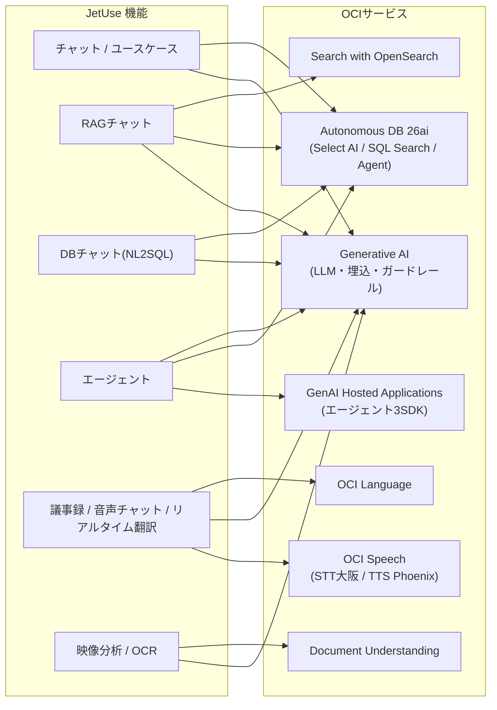
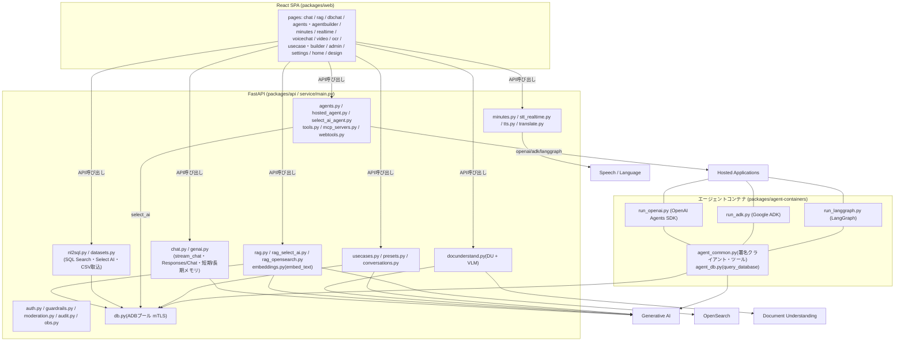
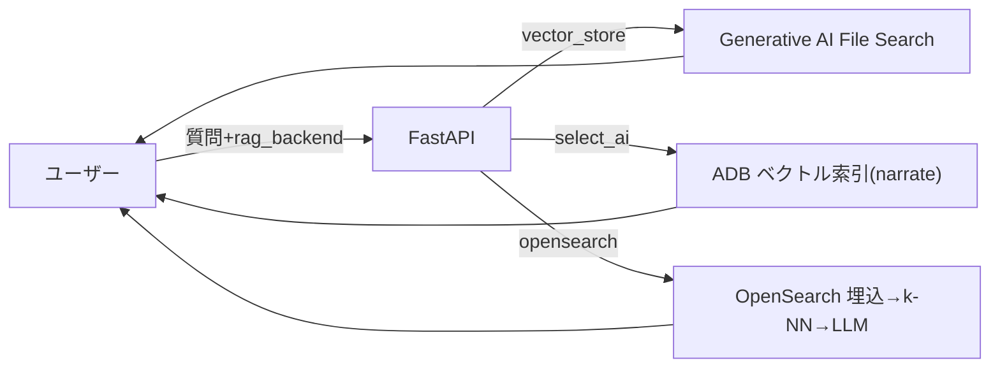
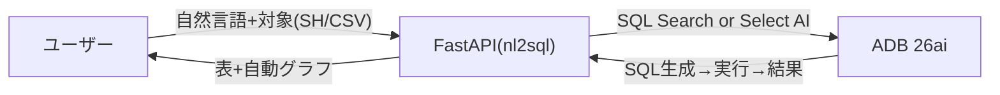
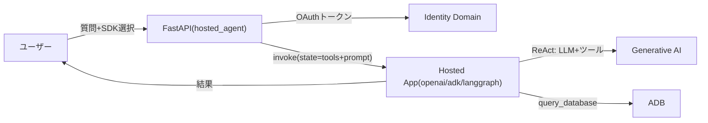
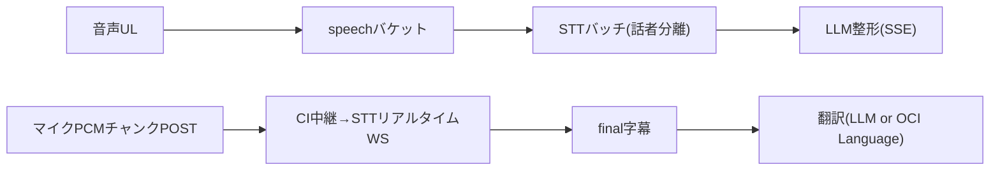
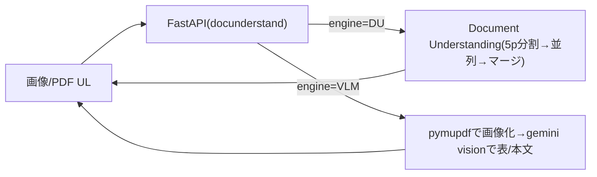

# システムアーキテクチャ（JetUse / 2026-06-17時点）

JetUse（AISA製。OCI版 JetUse プロトタイプ）のアーキテクチャを**粒度別**にまとめる。

1. [機能 × OCIサービス（最粗粒度）](#1-機能--ociサービス最粗粒度) — 各機能がどのOCIサービスを使うか
2. [インフラ アーキテクチャ](#2-インフラ-アーキテクチャ) — リージョン/VCN/サブネット/コンピュート/マネージドサービス
3. [ソフトウェア アーキテクチャ](#3-ソフトウェア-アーキテクチャ) — SPA / API / モジュール / バックエンド
4. [主要データフロー（機能別）](#4-主要データフロー機能別) — 代表的な処理シーケンス
5. [ルーティング・設計判断](#5-ルーティング設計判断adr)

> 図はこのファイル（Mermaid）を正とする。設計の背景は [decisions/](../decisions/)（ADR）、
> 各機能の実証は [verification/](../verification/)、知見は [KNOWLEDGE.md](../KNOWLEDGE.md) を参照。

---

## 1. 機能 × OCIサービス（最粗粒度）

**全機能で共通**に使う基盤サービス（以下マトリクスでは省略）:
**API Gateway**（入口/ルーティング）, **Object Storage**（SPA静的配信）,
**Container Instances / Functions**（API実行）, **Identity Domain**（ログインOIDC）,
**Logging / Monitoring**（可観測性）, **Container Registry**（イメージ）。

各機能が**固有に**使うAI/データ系サービス:

| JetUseの機能 | Generative AI<br>(LLM/埋込/ガードレール) | GenAI Hosted<br>Applications | Autonomous DB<br>(26ai) | OCI Speech | OCI Language | Document<br>Understanding | Search with<br>OpenSearch |
|---|:--:|:--:|:--:|:--:|:--:|:--:|:--:|
| チャット | ● | | ○履歴 | | | | |
| ユースケース | ● | | ○定義 | | | | |
| RAGチャット | ●生成/埋込 | | ○Select AI RAG | | | | ○OpenSearch RAG |
| DBチャット (NL2SQL) | ● | | ●SQL Search/Select AI | | | | |
| エージェント | ●(Select AI Agent) | ●OpenAI/ADK/LangGraph | ○定義/Select AI Agent | | | | |
| 議事録 | ●整形 | | ○保存 | ●STTバッチ(話者分離) | | | |
| リアルタイム翻訳 | ○LLM翻訳 | | | ●STTリアルタイム | ○OCI Language翻訳 | | |
| 音声チャット | ● | | | ●STT + ●TTS(Phoenix) | | | |
| 映像分析 | ●vision | | | | | | |
| OCR / 文書認識 | ●VLMエンジン | | | | | ●Document Understanding | |
| 管理 / 設定 | | | ○監査ログ | | | | |

●=主要 / ○=補助・任意・比較用。



---

## 2. インフラ アーキテクチャ

```mermaid
flowchart TB
  USER["ユーザー<br/>ブラウザ(React SPA / HashRouter)"]

  subgraph osaka["OCI ap-osaka-1 — compartment: jetuse-proto"]
    IDCS["Identity Domain jetuse-dev-domain<br/>OIDC(PKCEログイン) + OAuth(client_credentials)"]
    OCIR["Container Registry (OCIR)<br/>jetuse-dev-api / fn-router / agent-*"]
    LOGMON["Logging / Monitoring<br/>(jetuse-dev-app ログ・jetuse_dev メトリクス)"]

    subgraph vcn["VCN jetuse-dev-vcn"]
      subgraph pub["public subnet"]
        GW["API Gateway<br/>(JWT通過・パスルーティング)<br/>nsg-apigw: 443 in"]
      end
      subgraph priv["private subnet"]
        CI["Container Instance<br/>FastAPI 1OCPU/4GB<br/>SSE・STT中継・大容量UL / nsg-app"]
        FN["OCI Functions<br/>fnルーター 512MB<br/>presets/dbchat/tts"]
        OSC["OpenSearch クラスタ jetuse-dev-opensearch<br/>master/data/dashboard<br/>nsg-opensearch:9200/9300"]
      end
    end

    SPA[("Object Storage: jetuse-dev-spa<br/>SPA静的配信(PAR)")]
    DATA[("Object Storage<br/>jetuse-dev-app-data / -speech<br/>ウォレット・RAG原本・音声")]
    GENAI["Generative AI<br/>OpenAI互換API + embed_text + guardrails<br/>Project=jetuse-dev-project"]
    HOST["GenAI Hosted Applications/Deployments<br/>agent-openai / agent-adk / agent-langgraph"]
    ADB[("Autonomous DB 26ai jetusedev (mTLS)<br/>会話/定義/議事録/データセット<br/>Select AI・SQL Search・Select AI Agent")]
    SPEECH["OCI Speech<br/>STTバッチ/リアルタイム(Whisper)"]
    LANG["OCI Language (翻訳・任意)"]
    DOCU["Document Understanding (OCR)"]
  end

  PHX["OCI Speech TTS<br/>us-phoenix-1(日本語ボイス)"]
  EXT["外部: DuckDuckGo検索 / Webページ / MCPサーバー"]

  USER -->|HTTPS| GW
  USER -.->|PKCEログイン| IDCS
  GW -->|"静的配信(SPA)"| SPA
  GW -->|"/api/presets・dbchat・tts"| FN
  GW -->|"/api配下 (SSE・最大300s)"| CI
  CI --> GENAI & ADB & SPEECH & LANG & DOCU & DATA
  CI -->|"OAuthトークン取得"| IDCS
  CI -->|"invoke(署名)"| HOST
  CI -->|"k-NN(https/9200)"| OSC
  CI --> EXT
  FN --> GENAI & ADB & DATA
  FN -->|クロスリージョン| PHX
  HOST --> GENAI & ADB
  SPEECH --> DATA
  CI -. ログ/メトリクス .-> LOGMON
  CI <-. イメージ .- OCIR
```

要点:
- **ネットワーク**: API GW=publicサブネット、CI/Functions/OpenSearch=privateサブネット。CI→OpenSearchは
  nsg-opensearch(9200, VCN内)で許可。CIはegress全開放。
- **CI再作成でプライベートIPが変わる**ため、イメージ更新後は**フル`terraform apply`**でGWのbackend IPまで反映（[KNOWLEDGE.md §8](../KNOWLEDGE.md#8-インフラデプロイのハマり所重要)）。
- **TTSのみ us-phoenix-1**（大阪にTTSモデルなし。クロスリージョン呼び出しは追加IAM不要）。
- Terraform: `infra/terraform/`（modules: network/object_storage/adb/ocir/container-instance/functions/api-gateway/observability/identity_domain/iam/**opensearch**）。

---

## 3. ソフトウェア アーキテクチャ



- **エージェントは完全hosted化（ADR-0009）**: SDK選択（OpenAI Agents SDK / Google ADK / LangGraph）で
  対応するHosted Applicationコンテナへルーティング。Select AI選択時はADBの Select AI Agent を実行。
  ツール・プロンプトはステートとして送信。
- **RAGは3バックエンド**を `rag_backend` で切替（Vector Store / Select AI RAG / OpenSearch）。アップロードは全backendへ同時取り込み・状況を可視化。
- **OCRは2エンジン**（Document Understanding / VLM）を `engine` で切替。
- `auth/guardrails/moderation/audit/obs` は全リクエストを横断（認証・入力モデレーション・監査・可観測性）。

---

## 4. 主要データフロー（機能別）

### RAGチャット


### DBチャット（NL2SQL）


### ホスト型エージェント


### 音声（議事録 / リアルタイム翻訳）


### OCR


---

## 5. ルーティング・設計判断（ADR）

### API Gatewayルーティング（優先度順）
| パス | バックエンド | 用途 |
|---|---|---|
| `/api/presets` `/api/dbchat/*` `/api/tts`（完全一致+`{p*}`） | **Functions** | 短時間・非ストリーミング（ARCH-02） |
| `/api/ocr` | **Container Instance**（read_timeout=300） | 多ページOCR（同期ブロッキング、ENH-07d） |
| `/api/chat/{p*}` | Container Instance（read_timeout=300） | SSEチャット |
| `/api/{p*}` | Container Instance（read_timeout=60） | NL2SQL/議事録/RAG/STT中継/CRUD ほか |
| `/` `/{object*}` | Object Storage（PAR） | SPA静的配信（ADR-0004） |

### 主要な設計判断
| 判断 | ADR |
|---|---|
| 会話状態の正はADB | ADR-0002 |
| SSEはAPI Gateway経由 | ADR-0003 |
| SPAはObject Storage + GW静的配信（HashRouter） | ADR-0004 |
| Functions優先・SSE経路のみContainer Instances | ADR-0005 |
| 長期メモリはOCIネイティブ（Project LTM + memory_subject_id） | ADR-0006 |
| Agents SDKはChatCompletionsModel経由 | ADR-0007 |
| エージェント標準エンジン=OpenAI Agents SDK | ADR-0008 |
| **エージェント実行を3SDK別Hosted Applicationに集約（hosted専用ReAct）** | **ADR-0009** |

> レンダリング済みPNG（旧Phase 10版）: `docs/img/architecture.png`。再生成は
> `npx @mermaid-js/mermaid-cli -i <mmd> -o docs/img/architecture.png` 。
