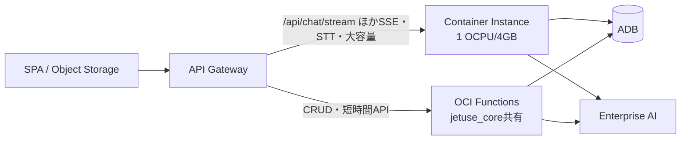

# 比較: APIコンピュート構成の最適化（ARCH-01）

現行=Container Instance（CI）1台に全API同居。「よりサーバレス・フルマネージド・低コスト」への
再配置を、全エンドポイントの棚卸しと月額試算で比較する（Phase 10、ADR-0005の実装段階）。

単価（2026-06時点リスト価格、PAYG）:

| サービス | 単価 | 無料枠 |
|---|---|---|
| Container Instances（E4.Flex） | OCPU $0.0255/h + メモリ $0.0015/GB/h（Computeと同額） | なし |
| OCI Functions | 呼出 $0.2/100万 + $0.00001417/GB秒 | **月200万呼出 + 40万GB秒** |
| API Gateway | $3.00/100万コール | 月100万コール |

出典: [Container Instances pricing](https://www.oracle.com/cloud/cloud-native/container-instances/pricing/) /
[OCI Price List](https://www.oracle.com/cloud/price-list/)（Functions無料枠は公式FAQ）

## エンドポイント棚卸し（45本、2026-06-12時点）

| 区分 | エンドポイント | 特性 | 行き先 |
|---|---|---|---|
| **A. SSEストリーミング** | chat/stream, chat/nl2sql, minutes/{id}/generate, stt/.../events, chat/ping | 数秒〜数分のストリーム応答 | **CI残留**（FunctionsはSSE不可 — ADR-0005） |
| **B. プロセス内状態** | stt/sessions, stt/.../audio（リアルタイムSTT中継） | OCI側WSセッションをメモリ保持 | **CI残留**（VOICE-02設計。外部化はコスト/複雑度増） |
| **C. 大容量アップロード** | rag/files（≤20MB）, minutes（音声≤100MB） | **Functionsのリクエスト6MB上限超** | 当面CI残留。恒久解は**PAR直接アップロード+登録APIの分離**（再設計でFunctions化可能） |
| **D. 短時間・非ストリーミング（38本）** | conversations/agents/mcp-servers/presets/usecases各CRUD、chat/models、dbchat(execute≤30s/chart/schema)、minutes(list/get/delete)、tts(±1.3s)、tools/extract-url、agent/execute-tool・tools、healthz | <1〜30秒、ステートレス | **Functions移行候補**（同期300s・6MB応答の制約内） |

## 月額コスト試算

想定負荷: 社内50ユーザー × 30リクエスト/営業日 ≒ **月3万コール**（D区分中心、平均0.5秒×0.5GB）。

| 構成 | 内訳 | 月額（概算） |
|---|---|---|
| ① 現行: CI 1 OCPU/8GB 常時起動 | $0.0375/h × 730h | **$27.4** |
| ② 分離後: CI右サイズ(1 OCPU/4GB) + D区分をFunctions | CI $23.0 + Functions **$0（無料枠内**: 3万呼出・7.5k GB秒） + GW $0（無料枠内） | **$23.0** |
| ③ ②+CI夜間停止（12h/日運用） | CI $11.5 + Functions $0 | **$11.5** |
| 参考: 利用10倍（30万コール/月）でも | Functions 7.5万GB秒 → 無料枠内 | ②③と同額 |

> ADB（ECPU2、自動停止なし）≈ $190/月など他リソースは本比較の対象外（compute部分のみ）。

## 評価 — コストより「障害分離・運用」が主便益

1. **コスト削減効果は小さい**（月$4〜、CIがSSE/状態系で残るため）。削減の主役は
   CIの右サイズと停止運用（③で半減以下）であり、Functions化そのものではない
2. **障害分離の価値が実証済みで大きい**: 2026-06-12にCI再作成失敗で**全API停止**の実障害
   （image pull失敗、復旧15分 — docs/verification/jetuse-app/FW-02.md）。D区分がFunctionsなら
   CRUD・一覧・TTS等は生き残り、チャット系のみの部分障害に抑えられた
3. **デプロイ独立性**: 現行は1行の変更でも全API再作成（壊してから作る）。Functions側は
   機能単位の独立デプロイになり、リスクと停止窓が縮む
4. Functionsの**コールドスタート**（コンテナ起動+ADBウォレット取得+mTLS接続）が
   実用性の関門 → ARCH-02で実測する（必要なら provisioned concurrency を追加検討。ただし有料）
5. 代替案の却下: OKE（Kubernetes）はスケール・self-healingに優れるが、
   「フルマネージド志向」と管理コストの観点でプロトタイプの選択肢から外す（計画 §12）

## 推奨ターゲット構成（ARCH-02以降で実装）

- 共有ロジックは `jetuse_core`（ADB接続・IAM署名・JWT検証）をそのまま両者で使う（ADR-0005の方針）
- API GWモジュールには `functions_routes` 変数が既設（INFRA-01）→ ルート分割は設定追加で可能
- 段階移行: まず読み取り系（models/schema/一覧）→ CRUD → tts/execute-tool の順で
  コールドスタート影響の小さいものから

## ARCH-02への持ち越し論点

- ~~コールドスタート実測~~ → **実測済み: 2.07秒**（ウォレット取得+mTLS込み。ARCH-02-04.md）
- C区分のPAR直接アップロード化（6MB制約の恒久解。バケットPAR発行→クライアント直PUT→登録API）
- JWT検証のGWオーソライザーFunction集約（各Functionでの個別検証を回避）
