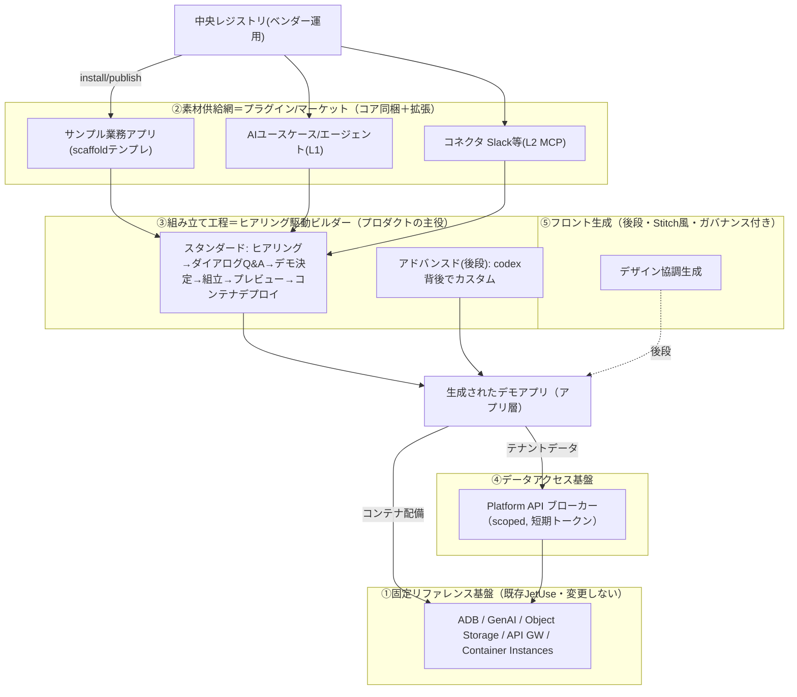

# JetUse デモ生成プラットフォーム化 実装計画

**版:** v2.0 / 2026-06-25
**入力アイデア:** [`202607.md`](202607.md)
**関連検討:** [`../comparison/marketplace-plugin.md`](../comparison/marketplace-plugin.md)（プラグイン/マーケットの方式比較。本書の決定はその未決ADR軸を解消する）
**位置づけ:** JetUse を「AIユースケース**集**アプリ」から「**フィールドSAのためのガバナンス付きAIデモ生成基盤**」へ拡張する設計・実装計画。決定は 2026-06-25 の施主との対話で確定（§2）。実装はループエンジニアリング（[`../../LOOP.md`](../../LOOP.md)）で進める。

> 本書 v2 は、初期検討の「プラグイン市場中心」案を「デモ生成基盤中心」へ再構成したもの。

---

## 1. なぜ作るか — ペルソナとポジショニング

### 1.1 主ペルソナ＝フィールドSA（アカウントチームの技術営業）
- AI専任チームのように顧客向けデモを自作するスキルセットを持たない。
- 放置すると **OCIリファレンスアーキテクチャから外れた構成**を提案してしまう。

### 1.2 狙い＝「中間レイヤー」を埋める
```
 ①既存アプリから選ぶだけ ──[硬すぎ・顧客に合わない]
        ▲
   ★ JetUse（本基盤）= 顧客業務に即した、OCIリファレンス実装から外れないデモを“組み立てられる”
        ▼
 ②Dify等のエージェント作成PF ──[知識要求が高すぎ・SAには敷居が高い]
```
**価値:** フィールドSAが、顧客ヒアリング結果から「業務に即してイメージしやすいデモ」を、**ガバナンスを効かせて短時間で量産**できる。AI専任チームの代替を非専門家が安全に行える。

### 1.3 組み立てライン（プロダクトの動作イメージ）
事前用意した素材〈**サンプル業務アプリ** ＋ **AI組込部品**（要約/RAG/NL2SQL/エージェント等）＋ **SaaSコネクタ**（Slack等）〉を元に:

- **スタンダードモード**: 顧客ヒアリング結果を入力 → **ダイアログ式の質問に順に回答** → 作るデモアプリを決定 → 組み立て → プレビュー → デプロイ（**上限はコンテナ**）。
- **アドバンスドモード（後段）**: **codex を背後**に、ガバナンス枠内でより深いカスタマイズ。
- **フロントエンド（後段）**: Google Stitch のように**デザインを議論しながら**構築（**自由度は縛る**）。

---

## 2. 確定した技術判断（対話の結論）

| # | 論点 | 決定 | 理由 |
| --- | --- | --- | --- |
| D1 | プラグインの定義 | **3層モデル** L1=宣言型(コード無)／L2=MCP・リモートツール／L3=ホスト型アプリ(コンテナ) | 既存資産(MCP・AGT-04)を活用、隔離サンドボックスを自作せず段階導入 |
| D2 | 「全インスタンスから参照」 | **中央レジストリをベンダー運用**（Object Storage + index + 署名） | 横断共有に忠実、各インスタンスは読取参照 |
| D3 | 既存資産(No.1-*) | **保留**（L3想定）。前提=コンテナアプリのテナントデータ接続（§7 Platform API） | 配備は容易だがデータ接続が未解決 |
| D4 | プラグイン配布のMVP | **宣言型(L1)の公開・インストール**（プラットフォームの配管） | 土台が揃い最短でループを回せる |
| D5 | データアクセス | **Platform API ブローカー**（スコープ付きAPI＋短期トークン。DB認証情報は渡さない） | テナント隔離・監査・レート制限がクリーン |
| D6 | インストール | **スナップショット取込**（版固定でADBへコピー、更新は明示再取込） | データはインスタンス所有、実行時レジストリ非依存 |
| D7 | 公開ガバナンス | **発行者ID＋署名付き直接公開**（審査は事後） | 宣言型はリスク低、MVPはこれで十分 |
| **D8** | **ビルダーの基盤前提** | **IaC生成は行わない。Galley不要。** デモは既存JetUseリファレンス基盤上で動き、**デプロイ上限はコンテナ**。ガバナンスは「固定基盤＋制約付きビルダー」で担保 | SAが触れるのはアプリ層のみ。基盤が固定だから“外れない” |
| **D9** | **サンプルアプリ/コネクタ** | **コア同梱＋マーケット拡張の両方**。sample-app=スキャフォールドテンプレ(plugin kind)、connector=L2 MCP | リファレンス品質をコアで担保しつつ拡張可能に |
| **D10** | **フロント生成(Stitch風)** | **後段フェーズ**。MVPはサンプルアプリのテンプレUIを流用 | まず動くデモ、見た目の自由生成は後 |
| **D11** | **2つのモード** | スタンダード=ヒアリング駆動ダイアログ合成／アドバンスド=codex背後のカスタム（**loop-engineering の延長**） | 非専門家はガイド、専門家は深掘り。両方ガバナンス枠内 |

---

## 3. プロダクト全体像（5レイヤー）



- **主役は③ヒアリング駆動ビルダー**。①は固定（触らせない＝ガバナンスの源）、②は素材、④はデータ接続、⑤は後段。
- 先行検討の「プラグイン市場」は **②素材供給網**として本基盤に内包される。

---

## 4. ガバナンスモデル — “リファレンスから外さない”の実装（§1のご動機への直接の解）

IaC検証（Galley的アプローチ）ではなく、**4つの制約**で担保する:

1. **固定リファレンス基盤（D8）**: **JetUse 自体が「機能カットのリファレンスアーキテクチャ」**であり、これをそのまま固定基盤とする（新規構築しない）。デモは既存JetUse基盤（ADB/GenAI/Object Storage/API GW/Container Instances）の上でのみ動く。SAはインフラを選べない＝**そもそも変なアーキにできない**。
2. **制約付きパレット**: ビルダーが提示する素材は、コア同梱＋審査済みマーケット品（署名付き）に限定。任意構成を組ませない。
3. **合成バリデーション**: 組み立て結果（sample-app × AI部品 × connector）を、許可された組合せ・必要ケイパビリティ・権限スコープでチェックしてからデプロイ。
4. **デプロイ上限＝コンテナ（D8）**: 出力はアプリ層成果物（宣言定義＋任意でコンテナ）。新規インフラのプロビジョニングは発生しない → 既存基盤の保証がそのまま効く。

> アドバンスドモード（codex）でも、この4制約の枠内でのみ変更を許す（loop-engineering の人間ゲート＋Codexレビューを流用）。

---

## 5. ヒアリング駆動ビルダー（プロダクトの主役）

### 5.1 スタンダードモード フロー
```
顧客ヒアリング結果を入力
  → ダイアログ式Q&A（業種/部門 → 対象業務 → 既存データ(DB/文書/SaaS) →
     望むAI機能(検索/要約/分類/NL2SQL/エージェント) → 連携先(Slack等) → 出力形態）
  → サンプル業務アプリ＋AI部品＋コネクタの構成を“推薦”
  → SAが調整・確定
  → 合成バリデーション（§4-3）
  → プレビュー
  → デプロイ（宣言定義の取込／必要ならコンテナ配備）
```
- 各回答は構造化保存し、**推薦は決定的なルール＋GenAI補助**で生成（ブラックボックスにしない）。
- 出力は「実行可能なデモ」＋「構成サマリ（顧客提示用）」。
- **質問セットと回答→素材マッピングの素案: [`202607-hearing-flow.md`](202607-hearing-flow.md)**（S2/HBD-01..03 の基礎）。

### 5.2 アドバンスドモード（後段, D11）
- スタンダードで組んだデモを起点に、**codex を背後**にカスタマイズ。
- **本リポジトリの loop-engineering（Claude×Codex×/goal）をそのまま流用**: 実装はAI、レビューはCodex、人間ゲートで承認。ガバナンス4制約を `loop-protocol`/`codex-review` の観点に組み込む。

---

## 6. 素材供給網＝プラグイン / マーケット / レジストリ（②）

`comparison/marketplace-plugin.md` の方式比較と整合。確定事項で未決軸は解消済み。

- **プラグイン種別（kind）**: `usecase` / `agent`（L1宣言型）／`tool`=`connector`（L2 MCP）／`sample-app`（scaffoldテンプレ）／`hosted-app`（L3）／`bundle`。
- **サンプル業務アプリ（D9・別途複数の独立トラック）**: scaffold テンプレート（UIテンプレ＋データモデル＋AI組込点の定義）。**コア同梱＋マーケット拡張**。
  - **コア同梱の初期セット（確定・4本／JetUseの能力を分担）**:
    | # | サンプルアプリ | 主なAI機能 | 使うJetUse能力 |
    |---|---|---|---|
    | SBA-A | 問い合わせ/サポート管理 | FAQ/マニュアルRAG回答・自動分類・要約・返信ドラフト | RAG(File Search)・要約・分類 |
    | SBA-B | 在庫・受発注照会 | 自然言語DB照会・結果グラフ化 | NL2SQL(SQL Search)・Chart |
    | SBA-C | 営業案件管理(SFA-lite) | 議事録要約・次アクション提案・売上集計・メール下書き | エージェント/ツール・議事録・NL2SQL |
    | SBA-D | 帳票・経費処理 | VLM-OCR読取・項目抽出・検証 | マルチモーダル/VLM（伝ぴょん題材, MM-01依存） |
  - 拡張候補（マーケットで後追加）: 社内ナレッジ/ヘルプデスク(RAG)、議事録/音声業務、契約書/文書レビュー 等。
- **コネクタ（D9）**: L2 MCP に正規化。**コア=Slack を1本**＋マーケット拡張（Teams/Email/Drive/Jira/ServiceNow/Salesforce 等）。
- **中央レジストリ（D2）**: ベンダー運用、Object Storage + `index.json` + 発行者公開鍵。読取公開／publishは発行者認証＋署名。
- **インストール（D6）**: スナップショット取込（版固定、`installed_plugins` に記録、取込定義に `source_plugin_id/version`）。
- **公開（D7）**: 発行者ID＋ed25519署名。インストール時に署名検証。
- **manifest（ドラフト）**: `schemaVersion/id(namespace/name)/version(semver)/kind/name/description/publisher/jetuse.minVersion/requires(models,datasources,tools)/permissions/contributes/icon/tags/license/signature`。正式仕様は `specs/16-platform.md`。

---

## 7. Platform API ブローカー（④ / D5・D3前提）

L2コネクタ・L3ホスト型アプリ・生成デモが、**DB認証情報を持たずに**テナントデータへ到達する唯一の正規経路。

- **スコープ例**: `platform:rag.search` / `platform:db.query`(読取) / `platform:conversations.read` / `platform:files.read|write` / `platform:connector.invoke`。
- **トークン**: 呼び出しごとに JetUse が発行する短期JWT（テナント=Project OCID・プラグインID・付与スコープ内包）。スコープは manifest `permissions` 由来でインストール/合成時に承認。
- **隔離・監査**: 全アクセスがブローカー経由 → 越境防止・レート制限・監査ログ（`audit.py`/`guardrails.py` 接続）。
- **L3への適用**: コンテナ起動時にベースURL＋短期トークンを注入 → **D3「コンテナがJetUse配下DBへ接続する仕組み」の解**。

---

## 8. （後段）フロントエンド生成（⑤ / D10）

- Stitch風に**デザインを議論しながら**生成。ただし **デザイントークン（Redwood）・コンポーネント語彙・レイアウト規約に自由度を縛る**（branding.json／既存design system活用）。
- MVPは**サンプルアプリのテンプレUIを流用**し、生成は後段フェーズで着手。

---

## 9. ロードマップ（ステージ）

> plan.md には「Phase 13: デモ生成プラットフォーム」として追補予定（反映は施主承認後）。本書内ではステージ表記。

| ステージ | 目的 | 主な内容 | 依存 |
| --- | --- | --- | --- |
| **S1（基盤/MVP）** | 配管＋“サンプルアプリにAI”の最小実証 | L1宣言型の公開/インストール（PLG-01..08）＋ コア sample-app 1本にAIユースケース組込 | — |
| **S2** | ヒアリング駆動スタンダードモード | ヒアリングフロー＋ダイアログUI＋合成＋バリデーション＋プレビュー | S1 |
| **S3** | コネクタ＋データ接続基盤 | Platform API ブローカー、Slackコネクタ(L2 MCP)、合成への組込 | S2 |
| **S4** | コンテナデプロイ＋マーケット拡張 | 生成デモのコンテナ配備(L3)＋Platform API注入、sample-app/connectorのマーケット流通、中央レジストリμService | S3 |
| **S5** | アドバンスド＋フロント生成 | codex背後カスタム（loop-eng流用）＋Stitch風ガバナンス付きフロント生成 | S4 |

- **S1+S2で「フィールドSAがガイドに沿って業務デモを組める」体験が成立**。S3以降は連携・配備・自由度の拡張。

---

## 10. タスク分解（ループエンジニアリング単位）

各タスク=1ブランチ/1PR、`/goal` ループ1本の粒度。完了条件は機械検証可能に。`tasks/<id>.md`（`tasks/_template.md` 準拠）へ落として実行。

### ステージ1（MVP）— 配管＋最初のサンプルアプリ

#### PLG-01: プラグイン manifest 仕様 + バリデータ
- 目的: 配布単位スキーマ確定＋検証。仕様参照: `specs/16-platform.md`／本書§6。依存: なし。
- 作業: spec起草／`jetuse_core/plugins/manifest.py`(pydantic+JSON Schema)／semver・id・署名フィールド検証／ADR-0013起票（3層・中央レジストリ・スナップショット・Platform API・**ガバナンス4制約**）。
- 完了条件: `pytest .../test_plugin_manifest.py` 全パス（正常/不正manifest網羅）。ADR-0013 存在。 規模:小。人間ゲート:ADR承認。

#### PLG-02: インスタンス側データモデル
- 目的: インストール状態の永続化と出所追跡。依存: PLG-01。
- 作業: migration（`installed_plugins`）／`usecases`/`agents` に `source_plugin_id/version`／リポジトリ層 `plugins/store.py`。
- 完了条件: migration適用が冪等成功、CRUD単体テスト全パス、既存取得が後方互換。 規模:小。

#### PLG-03: レジストリクライアント + 署名検証 + スナップショット取込
- 目的: install/uninstall コア（D6/D7）。依存: PLG-01,02。
- 作業: HTTPクライアント(list/get/download)／ed25519署名検証(公開鍵はレジストリ取得)／スナップショット取込(版固定)／uninstall。
- 完了条件: モックレジストリで install→ADB出現→uninstall→消滅 をE2E単体テスト。**署名不正は取込拒否**を含む。 規模:中。

#### PLG-04: 中央レジストリ Service（MVP）
- 目的: 共有レジストリ本体（D2）。依存: PLG-01。
- 作業: `packages/registry`(list/search/get/download/publish)／Object Storage保存層＋`index.json`／発行者認証＋公開鍵登録＋publish時署名検証／`infra/terraform/modules/plugin-registry`(**planまで**)。
- 完了条件: publish→index更新→list/get/download 統合テスト成立。Terraform plan クリーン。無署名publish拒否。`docs/verification/PLG-04.md`。 規模:大（必要なら04a=API/04b=Terraform分割）。人間ゲート:apply・課金。

#### PLG-05: 公開フロー（builder→export→署名→publish）
- 目的: 作った定義をマーケットへ（D7）。依存: PLG-01,04。
- 作業: UC/Agent定義→manifest化(export)／発行者鍵で署名／publish API／`builder.tsx`・`agentbuilder.tsx` に「公開」導線。
- 完了条件: builderからpublish→レジストリlistに出現をE2E（`docs/verification/PLG-05.md`）。`npm run build`成功・lintクリーン。 規模:中。

#### PLG-06: マーケットプレイス UI
- 目的: アプリ内マーケット。依存: PLG-03,04。
- 作業: `/marketplace`(一覧/検索/タグ/詳細)／install/uninstall→PLG-03／インストール済み・更新表示／左ナビ導線。
- 完了条件: 一覧→詳細→install→home出現→uninstall がUIで通る（`docs/verification/PLG-06.md`）。`npm run build`/`vitest`/lint パス。 規模:中〜大。

#### PLG-07: コントリビューションローダー
- 目的: インストール済み定義を既存エンジンへ統合。依存: PLG-02,03。
- 作業: `/api/usecases`・`/api/agents` がインストール済みを合算返却／出所バッジ／名前衝突解決。
- 完了条件: インストール済みUCが homeカードに出て `/uc/{id}` で実行・SSE出力。既存テスト後方互換。 規模:中。

#### SBA-01: サンプル業務アプリの構造定義（scaffold テンプレモデル）
- 目的: `kind: sample-app` の表現（UIテンプレ＋データモデル＋AI組込点）。依存: PLG-01。
- 作業: sample-app manifest拡張（screens/データシード/AI組込スロット）／scaffold取込ロジック／合成バリデーションの土台。
- 完了条件: サンプルapp定義のスキーマ検証＋取込の単体テスト。 規模:中。

#### SBA-02: AI組込フレームワーク＋コアアプリ SBA-A「問い合わせ/サポート管理」(RAG)
- 目的: 「業務アプリ＋AI」を実証し、以降のサンプルアプリの型を確立。依存: SBA-01, PLG-07。
- 作業: AI組込スロットの実行時バインド機構／コア sample-app SBA-A（テンプレUI＋FAQシード）／RAG回答・自動分類・要約・返信ドラフトを組込点に配置／home・実行導線。
- 完了条件: SBA-A デモが実環境で起動し、FAQ-RAG回答が動く。`docs/verification/SBA-02.md`。**人間チェックポイント**（デモ品質）。 規模:中〜大。

> **サンプルアプリ・カタログ・トラック**（SBA-03..05）: SBA-02 で確立した型に沿って残り3本を作る。S1後半〜S2と並行可（S2ビルダーは選べる素材が複数あるほど価値が出る）。各々 `docs/verification/` にデモ品質レポート＋人間チェックポイント。

#### SBA-03: コアアプリ SBA-B「在庫・受発注照会」(NL2SQL)
- 依存: SBA-02。作業: 業務DBスキーマ＋シード／NL2SQL照会UI／結果グラフ化（既存Chart）。完了条件: 日本語照会→生成SQL→読取実行→グラフ表示が実環境で動く。規模:中。

#### SBA-04: コアアプリ SBA-C「営業案件管理」(エージェント複合)
- 依存: SBA-02（＋議事録/エージェント既存機能）。作業: 案件データモデル＋シード／議事録要約・次アクション提案(エージェント)・売上集計(NL2SQL)・メール下書きを組込。完了条件: 複合AI機能が1アプリ内で連動して動く。規模:中〜大。

#### SBA-05: コアアプリ SBA-D「帳票・経費処理」(マルチモーダルOCR)
- 依存: SBA-02 ＋ **MM-01相当のVLM能力**（無ければ先行実装）。S4の伝ぴょんオンボードと連携。作業: 帳票アップロード→VLM-OCR読取→項目抽出・検証→登録ワークフロー。完了条件: サンプル帳票でOCR抽出・検証が実環境で動く。規模:中〜大。**人間ゲート**（マルチモーダル能力前提の確認）。

#### PLG-08: MVP E2E 実機検証（横断共有）
- 目的: インスタンス間共有の証明。依存: PLG-04..07。
- 作業: Aで公開→中央レジストリ→Bでインストール→実行。完了条件: 実環境成立＋`docs/verification/PLG-08.md`。人間ゲート:デモ承認。 規模:中。

### ステージ2 — ヒアリング駆動スタンダードモード（概要）
- **HBD-01**: ヒアリングフロー＆質問スキーマ（構造化保存）＋推薦ルールエンジン（決定的＋GenAI補助）。
- **HBD-02**: ダイアログ式UI（順次Q&A・回答保存・進捗）。
- **HBD-03**: 合成エンジン（sample-app×AI部品×connector→デモ構成生成）＋プレビュー。
- **HBD-04**: 合成バリデーション（§4-3 ガバナンス：許可組合せ・必要ケイパ・権限スコープ）。
- **HBD-05**: 構成サマリ出力（顧客提示用）＋E2E（ヒアリング→デモ起動）。

### ステージ3 — コネクタ＋Platform API（概要）
- **PAPI-01**: Platform API ブローカー設計ADR＋スパイク（§7）。
- **PAPI-02**: スコープ承認＋短期トークン発行。
- **PAPI-03**: Platform API 実装（rag.search/db.query/conversations/files/connector.invoke）。
- **CON-01**: コネクタ(L2 MCP)モデル＋manifest。 **CON-02**: Slackコネクタ（コア）。 **CON-03**: 合成への組込＋E2E。

### ステージ4 — コンテナデプロイ＋マーケット拡張（概要）
- **DEP-01**: 生成デモのコンテナ配備(L3, Phase 9基盤再利用)。 **DEP-02**: Platform API注入（D3解）。
- **MKT-01**: sample-app/connector のマーケット流通。 **MKT-02**: 中央レジストリμService（署名・版・評価, comparison §2-B）。
- **ASSET-01**: 既存資産オンボード（伝ぴょん=外部連携／No.1-RAG・SQL-Assist=MCP化, comparison §3）。**人間ゲート濃い**。

### ステージ5 — アドバンスド＋フロント生成（概要）
- **ADV-01**: codex背後カスタム（loop-engineering流用、ガバナンス4制約を観点化）。
- **FE-01**: Stitch風ガバナンス付きフロント生成（Redwoodトークン・コンポーネント語彙に拘束）。

---

## 11. 起票予定ADR / 未決事項
- **ADR-0013（PLG-01）**: プラットフォーム基盤（3層・中央レジストリ・スナップショット・Platform API・**ガバナンス4制約・IaC非生成/Galley不採用**）。
- **ADR-0014（S3）**: Platform API 認可モデル（スコープ・トークン・テナント境界）。
- **ADR-0015（S4）**: L3ホスト型/既存資産オンボード（実行基盤・SSO・データ注入）。
- 確定済: コア同梱サンプルアプリ＝SBA-A/B/C/D の4本（§6）。
- 未決細目: ヒアリング質問セットの確定（業種別テンプレ要否）／推薦エンジンの決定ルールとGenAI補助の境界／発行者鍵の配布・失効／フロント生成の自由度ライン。**各ステージ着手時に対話で確定**。

---

## 12. リスクと留意点
- **越境・最小権限（最重要）**: スナップショット取込（D6）＋Platform APIブローカー（D5）で「データはインスタンス所有・アクセスは仲介経由」を徹底。L3で直接DB資格情報を配らない。
- **ガバナンスの実効性**: §4の4制約が崩れると“外れないデモ”が成立しない。合成バリデーション（HBD-04）とパレット制限を弱めない。
- **スコープ肥大**: 主役はビルダー（S1-S2）。マーケット高度化（μService/署名/評価）と既存資産は S4 以降に寄せ、MVPを軽く保つ。
- **plan.md 整合**: 本書を正、plan.md に Phase 13 ポインタ追加（**施主承認後**）。

---

## 13. ループ運用への引き渡し
1. §10 各タスクを `tasks/<id>.md` に落とす。
2. ステージ1を上から `LOOP_TASK=<id> GOAL="..." claude` ＋ `/goal` で1本ずつ（Codexレビュー必須）。
3. 各完了で `docs/verification/*.md` を残し、人間ゲート（ADR承認・apply・デモ品質）で停止。
4. アドバンスドモード（S5）は本ループ機構そのものをプロダクト機能化する位置づけ。

> 次アクション候補: ①本書レビュー＆plan.md追補可否 ②ヒアリング質問セットの素案（S2の心臓部）③ステージ1タスクの `tasks/` 雛形生成 → PLG-01着手。コア同梱サンプルアプリは SBA-A/B/C/D に確定済（§6）。
