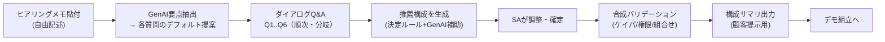

# スタンダードモード ヒアリング質問セット 素案

**版:** v0.1（素案・対話用） / 2026-06-25
**親計画:** [`202607-demo-platform-plan.md`](202607-demo-platform-plan.md) §5（S2 / HBD-01..03 の基礎）

スタンダードモードの中核 = 「顧客ヒアリング結果 → ダイアログ式Q&A → 素材（サンプルアプリ＋AI部品＋コネクタ）の推薦 → SAが確定 → 合成」。本書はその**質問セットと回答→素材マッピング**の素案。

---

## 1. 設計原則
- **フィールドSAが顧客ヒアリングから答えられる**問いだけにする（技術用語を最小化）。
- **素材選定は決定的マッピング**（監査可能）。GenAIは補助に限定（§6の境界）。
- **ガバナンス枠内**: 提示する選択肢は、コア同梱＋審査済みマーケット品に限定（任意構成を作らせない）。
- **短く**: コア質問は6問＋自動チェック1。分岐で深掘り。

## 2. 全体フロー

- **入力ステップ**: 顧客ヒアリングのメモを貼ると、GenAI が要点を抽出して Q1..Q6 のデフォルト選択を**提案**（SAは確認・修正するだけ＝ローコード補助の入口）。

## 3. 質問セット（コア6問＋自動チェック）

| ID | 質問（SA向け文言） | 目的 | 選択肢 | 素材マッピング |
|---|---|---|---|---|
| **Q1** | この顧客で AI を効かせたい**業務**は？ | 主サンプルアプリ決定 | 顧客対応/サポート ／ 営業・案件 ／ 在庫・受発注・データ照会 ／ 経理・帳票・経費 ／ その他(自由) | A→**SBA-A** ／ 営業→**SBA-C** ／ 在庫→**SBA-B** ／ 帳票→**SBA-D** ／ その他→GenAIが最近傍SBAを提案 |
| **Q2** | 扱う**主なデータ**はどこに？（複数可） | AI部品の素地決定 | 社内文書/FAQ/マニュアル ／ 業務DB(表・基幹) ／ 会議音声/通話 ／ 帳票/画像/スキャン ／ SaaS上 | 文書→RAG ／ DB→NL2SQL ／ 音声→議事録 ／ 画像→VLM-OCR ／ SaaS→コネクタ(S3) |
| **Q3** | 顧客が一番見たい**AIの効き所**は？（デモの主役） | 主役AIユースケース強調 | 質問に答える(RAG-QA) ／ 自然言語で集計・分析(NL2SQL) ／ 自動化・次アクション提案(エージェント) ／ 読取・抽出(OCR/分類) ／ 要約・ドラフト生成 | 主役AI部品をハイライト。SBAの組込点に優先配置 |
| **Q4** | **既存システム/SaaS連携**の希望は？ | コネクタ選定 | Slack 通知/起動 ／ Teams/Email/その他(後段) ／ なし(スタンドアロン) | Slack→**コネクタ(コア)** ／ 他→後段マーケット ／ なし→連携無し |
| **Q5** | デモの**利用シーン/出力形態**は？ | UI/出力テンプレ選定 | 画面で対話(チャット/フォーム) ／ 通知・自動投稿 ／ レポート/帳票出力 | SBAのUIテンプレ＋出力スロットを選択 |
| **Q6** | デモ用**データ**はどうする？ | シード戦略 | サンプルシードでOK ／ 顧客業界に寄せて生成(GenAI補助) ／ 顧客実データ風を後で差替 | シードデータの生成方針 |
| **Auto** | （自動）ケイパビリティ/権限/モデル可用性チェック | 合成バリデーション | — | 不足があれば警告＋代替提案（外させない） |

> 分岐例: Q2で「業務DB」かつ Q3で「集計・分析」→ SBA-B(NL2SQL)を主役に格上げ。Q2で「帳票/画像」→ SBA-D(VLM-OCR、MM-01能力の有無をAutoで確認)。

## 4. 回答 → 推薦構成の組み立て

推薦は3要素のセット:
1. **主サンプルアプリ**（Q1中心、Q3で補正）= SBA-A/B/C/D の1つ（複合なら主＋従）。
2. **AI部品セット**（Q2×Q3）= RAG-QA / 分類 / 要約 / NL2SQL / 議事録 / エージェント(次アクション) / VLM-OCR / ドラフト生成 から選択し、SBAの組込点に配置。
3. **コネクタ**（Q4）＋ **UI/出力**（Q5）＋ **シード**（Q6）。

例: 「サポート部門・社内マニュアル・質問に答える・Slack通知・画面対話・サンプルシード」
→ **SBA-A** ＋ {RAG-QA, 要約, 自動分類} ＋ Slackコネクタ ＋ チャットUI ＋ FAQシード。

## 5. 出力：推薦構成サマリ（顧客提示用）
- 構成図（どのデータに何のAIが効くか）／使うOCIサービス（＝固定リファレンス基盤の該当部分）／デモ手順／想定効果。
- これがそのまま SA の提案資料の下敷きになる（プリセールス転用）。

## 6. 推薦ロジック：決定ルール と GenAI補助の境界（未決事項の回答案）
- **決定的（ルール）でやる**: 素材の選定（SBA・AI部品・コネクタの対応）。表で固定し監査可能に。**最終選定は必ず画面でSAに提示**（ブラックボックス化しない）。
- **GenAI補助に限定**: ①ヒアリングメモからの要点抽出・デフォルト提案、②「その他/複合」時の最近傍SBA提案、③シードデータ生成、④構成サマリの文章化。
- **原則**: 「何を選ぶか」はルール＋SA確認、「埋める/書く/寄せる」はGenAI。これでガバナンスと省力化を両立。

## 7. データモデル（HBD-01 の素地）
- `hearing_session`: id / owner_sub / created_at / status / input_notes
- `hearing_answer`: session_id / question_id / value(JSON) / source(`sa` | `genai_suggested`)
- `recommendation`: session_id / sample_app / ai_parts(JSON) / connectors(JSON) / ui / seed_strategy / validation(JSON) / confirmed_at

## 8. 未決・次
- 業種別の質問テンプレ（製造/金融/流通…）を用意するか（Q1の選択肢を業種で出し分け）。
- Q3とSBA組込点の対応表の精緻化（各SBAがどのAI部品スロットを持つかは SBA-01/02 で確定）。
- 推薦の「複合（主＋従SBA）」をMVPで許すか、単一SBAに絞るか。
→ HBD-01 着手時に本書を `specs/16-platform.md` の一部へ昇格。
