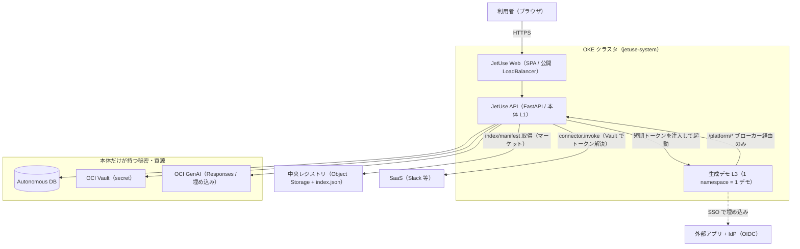
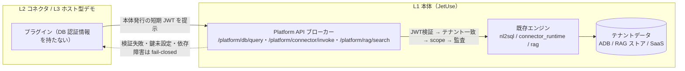
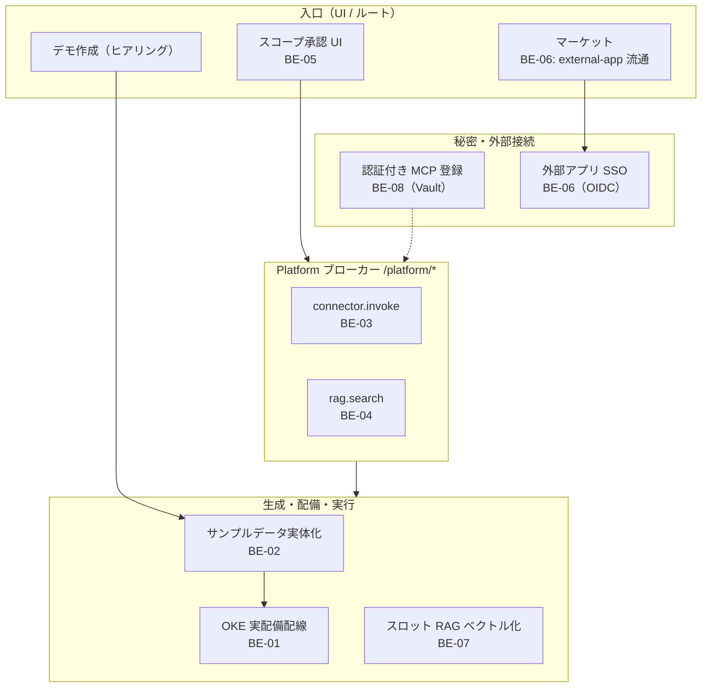
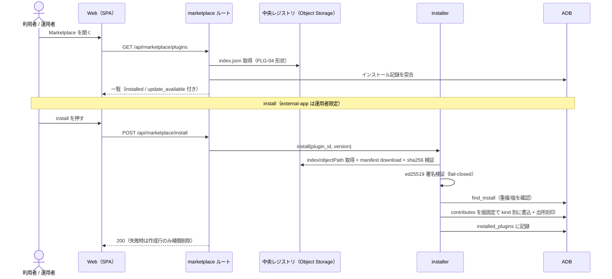
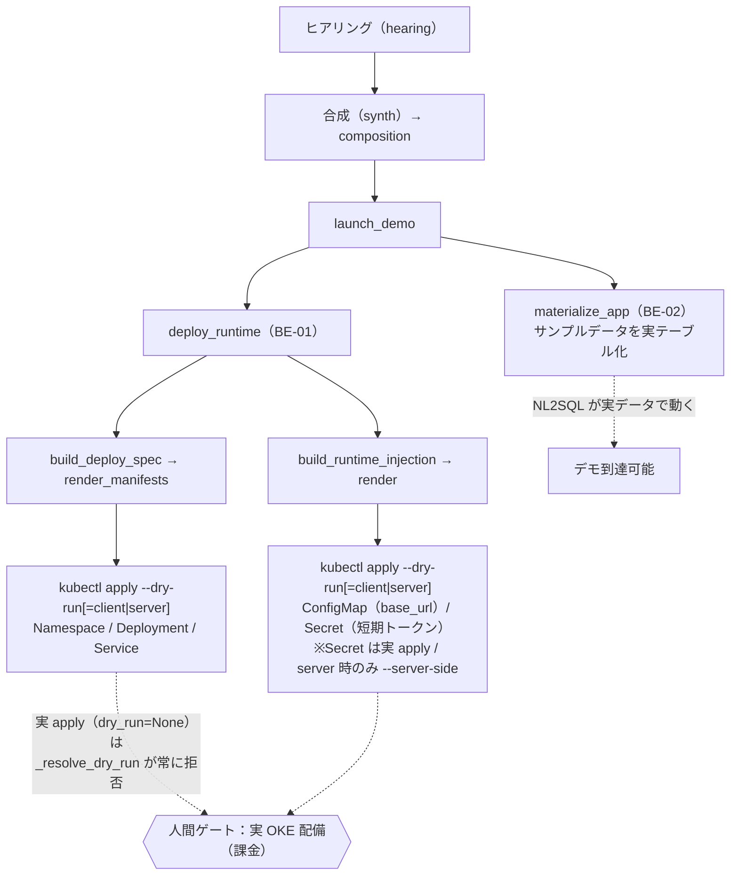
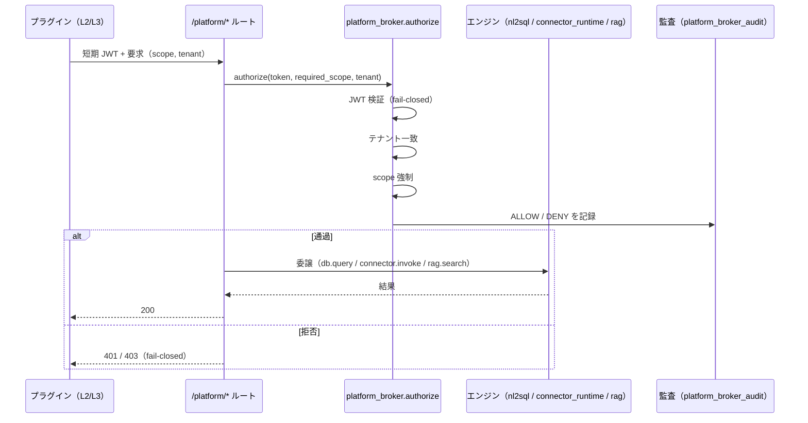
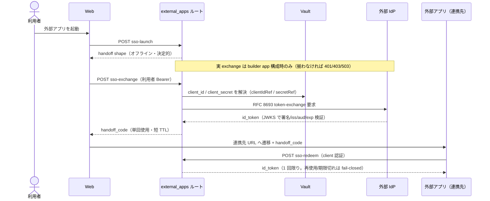

# ステージ6 実装解説 — 「画面は動くがバックエンド未実体」を実体化する

本ドキュメントは、ステージ6（2026-06-29〜30）で実装した8機能（BE-01〜08）が **技術的にどう動くか** を、
コードを読まなくても流れが追えるように解説する。対象読者はプリセールス／レビュアー／後続開発者。

- 正本の計画: [`202607-demo-platform-plan.md`](202607-demo-platform-plan.md) §9/§10 ステージ6
- 各タスク仕様: `tasks/BE-0*.md`、設計判断: `docs/decisions/ADR-0014〜0021`
- 関連メモ: 素デプロイの機能ギャップ（マーケット要設定・サンプルNL2SQLの実体化）

---

## 0. ステージ6 が解いた問題

2026-06-29 の OKE 実機デプロイ確認で「**画面（UI）は動くが、裏側が未実装/モック/未配線**」の箇所が判明した。
ステージ6 はそれらを実体化し、**素のデプロイで全機能が実際に動く**状態を目指した。分類は:

| 分類 | 意味 | 該当 |
|---|---|---|
| **A** 未配線/501 | ルートが無い or `501 Not Implemented` | BE-04 / BE-05 / BE-08 |
| **B** render/plan-only | 仕様を組み立てるが実行しない | BE-01 / BE-02 |
| **C** mock/fail-closed | 実接続せず安全側に倒す | BE-03 / BE-06 / BE-07 |

実装した8機能:

| ID | 機能 | ひとことで |
|---|---|---|
| BE-01 | デモ起動 → OKE 実配備配線 | 生成デモを OKE 上の独立ワークロードとして起動できる配線 |
| BE-02 | サンプルアプリのデータ自動マテリアライズ | デモ起動だけで NL2SQL 用の実テーブルが生成・投入される |
| BE-03 | コネクタ実行の実体化（Slack コア） | `connector.invoke` の 501 を解除し、実 HTTP で SaaS を呼ぶ |
| BE-04 | Platform RAG 検索の実体化 | `rag.search` の 501 を解除し、テナント RAG を file_search 委譲 |
| BE-05 | スコープ承認 API＋UI | ブローカートークンに scope を付与する到達経路（REST＋UI） |
| BE-06 | ASSET-01 実接続（外部アプリ SSO） | 外部アプリの OIDC SSO ブリッジと marketplace 流通 |
| BE-07 | スロット内 RAG retrieval のベクトル化 | 語彙重なり → 意味（ベクトル）検索へ。未設定時はフォールバック |
| BE-08 | 認証付き MCP サーバー登録 | 認証情報を Vault に束ね、認証付き MCP をチャットから利用 |

---

## A. アーキテクチャ全体像（俯瞰 → 詳細）

まず全体を俯瞰し、次にレイヤ構造、最後に各機能のフローへと降りていく。

### A.1 システムコンテキスト（いちばん外側）

利用者はブラウザで JetUse を使い、JetUse 本体（API）だけが秘密と資源を持つ。生成されたデモ（L3）や
コネクタ（L2）は**自分では秘密を持たず**、本体の Platform API（`/platform/*`）経由でのみテナントデータに届く。



### A.2 レイヤ構造とデータ到達経路（中核の設計）

「秘密は本体だけが持ち、L2/L3 はブローカー経由でしかテナントデータに届かない」が全機能の前提。



### A.3 機能マップ（どの BE がどこに効くか）



---

## 1. すべての土台 — Platform API ブローカーと fail-closed

個々の機能の前に、ステージ6 全体が乗っている**共通設計**を押さえると理解が早い（ADR-0014）。

### 1.1 「秘密は本体だけが持つ」— ブローカー一本化

JetUse が生成するデモ（L3）や、束ねるコネクタ（L2）は、**DB 認証情報も SaaS トークンも持たない**。
代わりに、本体（JetUse）が発行する **短期トークン（broker JWT）** を提示し、本体の
`Platform API`（`/platform/*`）経由でのみテナントデータへ到達する。

```
L3 デモ / L2 コネクタ
   │  broker が発行した短期 JWT を提示
   ▼
/platform/{db.query | connector.invoke | rag.search}
   │  platform_broker.authorize(token, required_scope, tenant=...)
   │    = JWT 検証(fail-closed) → テナント一致 → scope 強制 → 監査(ALLOW/DENY)
   ▼
通過した範囲だけ 既存エンジン(nl2sql / connector_runtime / rag) へ委譲
```

- 検証鍵は常にブローカー側が持つ。呼び出し元はエンドユーザではなく**プラグイン**。
- これは利用者ログイン（OIDC のユーザトークン）とは**別系統**である。

### 1.2 fail-closed（迷ったら閉じる）

全エンドポイントが、ブローカー拒否（`BrokerDenied`）・鍵未設定（`BrokerConfigError`）・依存障害を
**機械的に HTTP ステータスへ写像**し、認可を曖昧なまま素通りさせない。「実接続の準備が無ければ動かない
（503/501）」を既定にすることで、**素デプロイでも危険な状態にならない**。

### 1.3 人間ゲート（自動で越えない壁）

実 OKE への apply・課金・**実 Vault への IAM 権限付与/実シークレット投入**・IAM/Identity Domain 変更・
真の決定を伴う ADR 承認は、**開発の自走では越えない**（実環境の課金・越権・不可逆操作を起こさない）。
各機能は「実値・実権限を入れれば動く」状態まで配線し、未実施範囲を `runs/<run-id>/e2e/SKIPPED.md` に明記する。

> 区別が重要: 「人間ゲート」は**実環境の権限・課金・不可逆操作**であって、コードの実行そのものではない。
> 例えば BE-08 の認証付き MCP 登録は、Vault 設定（`vault_ocid` 等）と権限が揃えば **実際に `create_secret` を
> 実行する**（未設定/権限不足のときだけ 503 fail-closed）。自走 E2E が越えないのは「実 Vault への書込 IAM を
> 付与する／本番の実値を投入する」側であって、実装が常に no-op という意味ではない。

---

## 2. マーケットプレイス — プラグインの配布と取込

> 「画面の Marketplace を開くと一覧が出て、install/uninstall できる」の裏側。

### 2.1 配布レイアウト（中央レジストリ）

ベンダーが運用する**中央レジストリ**は、ただの Object Storage バケットである。マーケットプレイス
ルートは **実運用形状（PLG-04）を読む `CentralRegistryClient`（`central_registry.py`）** を使う:

```
<base>/index.json                     ← プラグイン一覧 ＋ 発行者公開鍵
<base>/<objectPath...>                ← 各エントリが指す manifest 全文 JSON（成果物）
```

`index.json`（`schemaVersion="1"`）の `plugins[]` は
`{id, version, kind, name, description, publisher, tags, objectPath, sha256, publicKeyId, publishedAt}`。
成果物（manifest 全文）は各エントリの **`objectPath`** にあり、**`sha256`** で完全性を検証する（取り違え/改竄を
取込前に弾く）。`publisherKeys` は **発行者で入れ子**（`{ "<publisher>": { "<keyId>": {publicKeyId, publicKey} } }`）。

- レジストリ URL は運用者が設定する**信頼済みの値**（`settings.plugin_registry_url`）であり、ユーザー入力ごとの
  SSRF 面ではない。クライアントは `base_url` 配下を相対パス強制・リダイレクト不追従で GET する。
- 補足: `registry_client.py`（PLG-03 `RegistryClient`）は **モック前提の簡易形状**（`plugins[].manifest` パス＋
  flat な `publisherKeys`）を読む別実装。両者は installer が必要とする同じクライアント契約
  （`list` / `download` / `public_key` / `base_url`）を満たすため、**installer をそのまま再利用できる**。

> 実機では、既存バケット `jetuse-registry` に読取 PAR を発行し、`PLUGIN_REGISTRY_URL` に設定する。
> 未設定だと `/api/marketplace/plugins` は **503**「プラグインレジストリが未設定です」を返す（機能無効）。

### 2.2 取込（install）の安全性 — 署名・版固定・出所追跡・補償削除

`installer.py` が中央レジストリの manifest を ADB へ取り込む。4つの安全装置を持つ:

1. **ed25519 署名検証**（`manifest.verify_signature`）: manifest の `signature.publicKeyId` を
   `publisherKeys` で引いて検証。改竄・偽発行を **fail-closed** で弾く。
2. **版固定スナップショット取込**: 取り込んだ時点の manifest を固定保存（同一 `(plugin_id, version)` の
   二重取込を防ぐ）。後でレジストリ側が同版を書き換えても、取込済みは暗黙で変わらない。
3. **kind 別取込先への分岐**（取込の枠組みは kind 非依存）:

   | kind | 取込先 | 永続化関数 |
   |---|---|---|
   | usecase / agent | UC・Agent 定義 | `usecases/agents.insert_ingested` |
   | sample-app | scaffold 展開 | `scaffold.scaffold_sample_app` |
   | connector | connector 登録 | `connector_store.register_connector` |
   | **external-app** | external-app instance | `external_app_store.register_external_app`（BE-06 で追加） |

4. **出所追跡＋補償削除**: 取込定義に出所（`source_plugin_id` / `source_version`）を刻む。
   - **uninstall** は出所キー（source）単位で取込定義を除去する。
   - **install 途中失敗時**は `_delete_created(created)` で **今回作成した行だけ**を補償削除する（同一 source の
     既存行は消さない）。「取込定義を先に書き、インストール記録を最後に書く」順序と合わせ、実務上の整合を担保。

### 2.3 一覧 API の動き

`GET /api/marketplace/plugins` は **(a) レジストリの index 形状**から候補を組み立て、**(b) ADB の
インストール記録**を突き合わせて `installed` / `update_available` / `can_uninstall` などの状態を付ける。
つまり **HTTP（レジストリ取得）＋ DB（インストール状態）の両方**を使う。どちらかが落ちると一覧は出ない
（例: ADB 停止時は `503 database unavailable`）。

### 2.4 BE-06 の追加: external-app の install 対応と運用者ゲート

`marketplace.SUPPORTED_KINDS` に `external-app` を追加。external-app は SSO 起動導線（外部 URL）を
**全利用者へ platform-wide に露出**するため、install/uninstall を **運用者（ADMIN_USERS）限定**にした
（`_ADMIN_ONLY_KINDS`）。他 kind は従来どおりセルフサービス。

### 2.5 一覧と取込のシーケンス（詳細）



---

## 3. デモ作成・起動 — ヒアリングから OKE 配備まで

> 「ヒアリングに答える → デモが生成されて URL で開ける」の裏側。BE-01 はその最終段
> （launch → OKE 実配備）を**配線**した。

### 3.1 描画（render）と実行（apply）の分離

BE-01（`deploy_runtime.py`）は、既存の決定的な**描画**部品を **kubectl 実行**につなぐ一本の
オーケストレーションである:

```
composition → build_deploy_spec → render_manifests → kubectl apply（base: Namespace/Deployment/Service）
            → （要すれば）build_runtime_injection → render_injection_manifests
              → kubectl apply（注入 ConfigMap: base_url ／ Secret: 短期トークン）
```

- **描画側（`deploy.py` / `deploy_inject.py`）** が fail-closed（秘密 allowlist・スコープ閉包・テナント
  分離・命名健全化）を担保し、**実行側（`kube.py`）** は描画結果を流すだけ（秘密の判断を持たない）。
- **1 namespace = 1 デモ**。削除は `kubectl delete namespace` で namespace ごと撤去できる形（trivial delete）。
  ただし BE-01 では `teardown_demo` も **dry-run 検証のみ**で、実 namespace 撤去は実 apply と同じ人間ゲート／別タスク
  （実 namespace を持ち得る記録は削除 API も 409 で消さない）。
- 配備 prefix に launch 一意キー（session/launch id）と tenant のハッシュを含め、同一 sample-app の
  複数 launch が **namespace 衝突しない**。

ヒアリングから配備までの全体（マテリアライズ BE-02 と配備 BE-01 がどこで効くか）:



### 3.2 「実配備は人間ゲート」を構造で担保

BE-01 のスコープは **配線＋マニフェスト検証まで**。実 OKE への apply は課金・人間ゲートなので、
本モジュールは **dry-run 検証のみ**を行う:

- `--dry-run=client`（オフライン検証）/ `--dry-run=server`（実クラスタ検証）。いずれも
  **リソースを作成・変更・削除しない**。
- 実 apply（`dry_run=None`）は `_resolve_dry_run` が**常に拒否**する。つまり「公開引数を渡せば実 apply
  できてしまう」バイパスを**構造的に塞ぐ**。実行層ゲート `settings.oke_deploy_enabled`（既定 OFF）も必須で、
  既定では一切実行しない（後方互換）。
- `kube.py` には保護 namespace（`kube-system` 等）の削除拒否、DNS-1123 名検証、短期トークン Secret の
  `--server-side` apply（client-side だと平文が annotation に残るため）等の安全装置がある。

> 実 OKE 配備とそのライフサイクル（孤児化防止・所有権/UID 照合・トークン定期更新）は別タスク。
> 本 run では dry-run（無痕）まで実機検証し、実 apply 範囲は SKIPPED.md に明記している。

---

## 4. サンプルデータの自動マテリアライズ（BE-02）

> 「新規デモを起動しただけで、在庫照会（NL2SQL）が実データで動く」の裏側。
> 旧実装は `SeedPlan` が**行数を数えるだけ（plan-only）**で実テーブルを作らず、`ORA-00942`（表が無い）が出ていた。

`materialize.py` は、**デモ起動時**（`launch_demo` → `materialize_app`、コア同梱 sample-app を
`sample_app_registry` で解決）に `SampleAppDefinition` の datasets を
**実テーブルとして CREATE → seed 投入 → 読取ユーザ（`adb_query_user`）へ GRANT SELECT** する。
NL2SQL の許可テーブル `dataset.name.upper()` と物理テーブルが 1:1、列は `dataset.fields` から 1:1 生成
（定義外の列を物理的に存在させない＝列スコープ担保）。

> 注: マーケットから install した sample-app の `scaffold_sample_app` は、定義と seed 行を
> `sample_app_instances` / `sample_app_seed_rows` に永続化するだけで、**物理 NL2SQL テーブルの作成・GRANT は
> 行わない**（実テーブル化はデモ起動時の `materialize_app` の役割）。

設計の肝は「**壊さない・混ぜない・壊れたら直す・直列**」:

- **作成先 = 読取先 = `target_schema()`**（`SAMPLE_DB_SCHEMA` か未設定なら接続ユーザ）。作成は接続ユーザ
  自身のスキーマでしかできないため、直接の `materialize_definition` は不一致を `MaterializeConfigError` で
  **失敗**させ、原因不明の `ORA-00942` を未然に検出する。ただし launch の自動マテリアライズ（`materialize_app`）は、
  専用外部スキーマ（dedicated）や事前プロビジョン済みスキーマでは **`skipped` を返して非破壊に進む**（対象外を壊さない）。
- **非破壊起動**: 通常起動（`recreate=False`）は**データを持つ表を決して DROP しない**。作り直すのは
  明示 `recreate=True`（管理者/E2E）か、**空表（行0）の不完全/形不一致**のときだけ。
- **seed 状態の追跡**: 空のまま作られた表へ後から「seed あり」起動が来たら、空のときに限り seed を注入。
- **所有権**: レジストリに owner を記録し、管理外の同名物理表や別 owner の同名表は触らず
  `MaterializeConflictError`（別アプリのデータ混在・無断 DROP を防ぐ）。
- **直列化**: 同一 `schema.table` の materialize を `DBMS_LOCK` で直列化。ロック不可は **fail-closed**
  （縮退しない）。DDL は暗黙コミットでトランザクションにならないため、途中失敗は `pending` で残し、
  次回ロック下で安全に再構築（`pending → ready` で回復）。

> CSV アップロード経路（`datasets.py`）は改変しない。専用外部スキーマで運用する SBA-C は対象外。

---

## 5. Platform API ブローカーの中身（BE-03 / 04 / 05）

§1 のブローカー（`platform.py`）の各エンドポイントを実体化したのがこの3つ。共通の入口は
`platform_broker.authorize`（fail-closed）で、通過した範囲だけ各エンジンへ委譲する:



### 5.1 BE-03 — `connector.invoke`（コネクタ実行）

旧 `501` を解除し、authorize ＋ コネクタ/action 存在検証 ＋ **コア Slack の版固定整合**（canonical な
version/provider/transport 検証）の後、`connector_runtime.invoke_connector_action` へ委譲して**実 invoke** する。
なお **呼出主体の所有一致（owner マッチ）は要求しない**（コア Slack は単一プラグインが持つ共有 capability。
実際の呼出主体は invoke を承認された別の L3 デモ）。越境境界は下の tenant 認可・コア限定・secret 束縛が担う。

- 実行対象は**コア builtin Slack に限定**（`jetuse/slack-connector` ＋ `transport=builtin`）。
  MCP transport / サードパーティ builtin は **501**（実行時 SSRF ガードは後続 CON-03）。
- secret（Slack Bot トークン等）は **`{tenant}/{呼出 plugin}/{connector}/{ref}` の合成キー**で Vault 解決。
  別プラグイン・別テナント・別接続が互いの秘密を解決できない（confused-deputy / 越境 / 取り違え防止）。
- 到達性（誰が invoke を呼べるか）は **方式A**: コネクタを束ねる消費側デモが自身の manifest に
  `platform:connector.invoke` を宣言 → 承認 → トークン発行 → ルート到達（ADR-0020）。
- エラー写像（`connector_runtime.py` の例外分類に準拠）: secret 解決不能・Vault/設定障害や `invalid_auth`/
  `missing_scope` 等の認可・資格情報系 = **503**、外部 SaaS への到達/応答障害 = **502**、allowlist された
  リクエスト不正（`channel_not_found` / `msg_too_long` 等）= **400**。実 Slack トークン・実 Vault・
  `secrets:read` IAM は**人間ゲート**（mock E2E で検証）。

### 5.2 BE-04 — `rag.search`（テナント RAG 検索）

旧 `501` を解除し、authorize 後に **テナント→ストア登録簿** からベクトルストアを解決し、
**OCI Responses `file_search`** へ委譲して「ヒット＋引用＋根拠付き回答」を返す（ADR-0019）。

- 既存の RAG（`rag_stores`）は **OIDC ユーザ単位**でテナント単位でなかったため、テナント検索が成立しなかった。
  そこで **`platform_rag_stores`（tenant PK → vector_store_id, UNIQUE）** を新設し、`rag.search` は
  **この登録簿だけ**からストアを解決する。呼び出し元は store id を渡さない/受け取らない（秘密保持）。
- 越境の**主境界**: authorize の tenant 一致 ＋ 登録簿が store id を隠す（呼び出し元に渡さない）＋
  `UNIQUE(vector_store_id)`（1ストア=高々1テナント）。**per-tenant GenAI Project 分離は best-effort の第二境界**
  （当該テナンシでは GenAI Project 所有の厳密検証は保証されないため、一次境界は上記）。ストア未登録テナントは
  **空ヒットの 200**（越境 403 とは区別）。
- 登録は SA 限定 `PUT /platform/rag/stores`（実在検証＋別テナント既登録なら 409＋監査）。

> 実機 Tips（コードにコメント済）: ap-osaka-1 の file_search は `instructions` 併用や長い和文で 500 を誘発、
> `tool_choice="required"` で必ず検索。`vector_stores.retrieve` は CP エンドポイント限定。

### 5.3 BE-05 — スコープ承認 API＋UI

承認ロジック（`platform_grants.approve_scopes`）は実装済みだったが**到達経路が無かった**。BE-05 は
**REST ルート（`POST/DELETE /platform/grants`）＋ 承認 UI** を足し、manifest 宣言スコープの範囲内
（二重閉包）でブローカートークンに scope を付与できるようにした。承認は人間操作（自動承認しない）、
範囲外 scope は fail-closed で拒否＋監査記録。これで `/platform/*`（db/connector/rag）が実運用で通る。

---

## 6. スロット内 RAG のベクトル化（BE-07）

> サンプルアプリ AI スロットの検索品質を上げる。生成側は既に実 GenAI。

`ai_runtime.py` の `retrieve` を、**語彙重なり（keyword-overlap）の簡易スコアから semantic/vector
retrieval** へ置き換えた。埋め込みは既存の OCI 埋め込み経路（`cohere.embed-multilingual-v3.0`）を
**再利用**し、新規ベクトル DB は導入しない。

- コサイン類似で grounded/採用を判定（採用下限を校正）。1 回の retrieval で埋め込むコーパス行は上限
  （OCI 埋め込みの 1 リクエスト96上限）。
- **フォールバック**: `settings.sample_app_semantic_retrieval=False`（ベクトル未設定）・埋め込み呼び出し失敗・
  **コーパスが上限（96 件）超**・**query/コーパスが長すぎる**いずれの場合も、埋め込みせず**従来の語彙重なりスコアへ
  degrade** する。これにより素デプロイでも壊れない（後方互換）。

---

## 7. 認証付き MCP サーバー登録（BE-08）

> チャット/エージェントから「認証が要る MCP サーバー」を使えるようにする。旧実装は `501`
> （「Vault 書込権限が要る」）。

`mcp_servers.py` は、認証付き MCP の生トークンを **Vault に書込み、DB には OCID 参照のみ**保持する
（`secret_managed=1` ＝アプリ管理。削除時に secret も削除予約）。実値は DB/コードに置かない（ADR-0014）。

- **SSRF/URL ガードは Vault 書込の前**に効く（不正 URL では Vault を一切触らない＝ fail-closed）。
- 後方互換: 既に外部で作成済みの secret OCID をそのまま登録する従来経路（`secret_managed=0` ＝外部管理。
  削除時に Vault を触らない）も残す。
- 実 Vault 書込に要る IAM ポリシー追加は**人間ゲート**（IaC ドラフトあり）。未設定時は fail-closed。

---

## 8. 外部アプリ SSO ブリッジ（BE-06 / ASSET-01）

> 伝ぴょんのような**外部アプリの UI そのもの**を JetUse に埋め込み（iframe/link）、**OIDC SSO** で
> ログイン状態を引き継ぐオンボード（コネクタが「外部 API を呼ぶ」のと対になる方式）。

`external_app.py` は `kind: external-app` の配布表現と SSO ブリッジを実装する（ADR-0021）:

- `embed`（iframe/link）＋ `url`（外部アプリの HTTPS）。url 検証は**オフライン・決定的**
  （DNS 解決しない／https・公開ホスト・private/loopback 拒否・認証値禁止）。
- `sso` = OIDC SSO ブリッジ宣言。`issuer` / `clientIdRef` / `secretRef`（client_secret の**論理参照名**＝
  Vault 束ね対象）/ `audience` / `scopes` / `claimMapping`。**実 client_secret/実トークンは一切持たない**
  （参照名のみ）。
- `build_sso_handoff`（→ 実接続版 `exchange_sso_token`）は **RFC 8693 token-exchange** の要求 shape を
  組み立てる seam。実値の注入だけを人間ゲートにする（実 IdP 接続・Vault secret・Identity Domain での
  OIDC クライアント発行は越えない）。
- ブラウザに id_token を直接返さない（front-channel 漏洩回避）。実 exchange 後に **単回使用・短 TTL の
  handoff code**（`sso_handoff_store`）を発行し、連携先がバックチャネルで 1 回だけ id_token を受領する
  （OAuth 認可コード型。再使用・期限切れ・別アプリ流用は fail-closed）。

> 現状の到達範囲（`external_apps.py`）: マーケットから **install 済みの external-app は platform-wide に
> surface** され、一覧と `sso-launch`（オフラインの handoff shape 生成）までは返せる。一方、**実
> `sso-exchange` / `sso-redeem` は、管理者が `.env` で構成した builder app のみ**に限定される（installed-only
> instance は `sso-exchange` で 403）。実 exchange には `AUTH_REQUIRED=true`・`tokenEndpoint`・Vault secret
> OCID・JWKS URL・利用者の Bearer が揃う必要があり、いずれも**人間ゲート**（揃わなければ 401/403/503）。

SSO の流れ（id_token をブラウザに晒さない単回 handoff code バックチャネル。実 exchange は builder app 構成時のみ）:



---

## 9. この開発を支えた「進め方」

機能そのものだけでなく、**どう作ったか**もステージ6 の要点である。

- **spec-driven ＋ ADR**: 仕様にない判断が要るときは実装を止め、ADR ドラフトを書いて人間レビューを要求した
  （例: BE-04 の ADR-0019、BE-03 の ADR-0020、BE-06 の ADR-0021）。承認後に実装を PASS まで進めた。
- **maker / checker の分離ループ**: 実装は Claude（maker）、レビューは Codex（checker）。別ツール・別モデルで
  分離し、**Codex の判定（PASS/FAIL）を Claude が書き換えない**。FAIL は次イテレーションで修正。
- **実機検証主義**: 「ドキュメントにそう書いてある」は完了条件にしない。jetuse-dev 実環境（固定 loop 環境・
  loop ADB 再利用）へデプロイし、各タスクの E2E シナリオを最低2本実行して証跡を `runs/<run-id>/e2e/` に残し、
  **証跡込みで Codex が PASS** して初めて完了とした（例: BE-04 は実 ADB＋実 GenAI file_search で 5/5）。
- **ステージ承認ループ**: 人間ゲートをタスク単位ではなく**ステージ境界に集約**。PASS したタスクを隔離ブランチ
  `feat/stage-6` へ自動統合して波を繋ぎ、ステージ完了で1回だけ人間に報告。push/PR/apply/IAM/ADR 承認は
  自走中も停止した。

---

## 付録: 機能 → 主な実装ファイル

| 機能 | 主なファイル |
|---|---|
| マーケット（配布/取込） | `jetuse_core/plugins/{registry_client,central_registry,installer}.py`、`service/routes/marketplace.py` |
| デモ起動 → OKE 配備 | `jetuse_core/{deploy_runtime,kube,deploy,deploy_inject}.py`、`service/routes/hearing.py` |
| サンプルデータ自動生成 | `jetuse_core/materialize.py`、`service/routes/{hearing,sample_apps}.py` |
| Platform ブローカー | `service/routes/platform.py`、`jetuse_core/platform_broker.py`（authorize の中核）、`jetuse_core/platform_grants.py`、`jetuse_core/plugins/connector_runtime.py`、`jetuse_core/rag.py` |
| スロット RAG ベクトル化 | `jetuse_core/plugins/ai_runtime.py`、`jetuse_core/embeddings.py` |
| 認証付き MCP | `jetuse_core/mcp_servers.py`、`service/routes/agents.py` |
| 外部アプリ SSO | `jetuse_core/plugins/{external_app,external_app_store,sso_handoff_store}.py`、`service/routes/external_apps.py` |
| マイグレーション | `jetuse_core/migrations/023〜026_*.sql` |
| 設計判断（ADR） | `docs/decisions/ADR-0014〜0021` |
