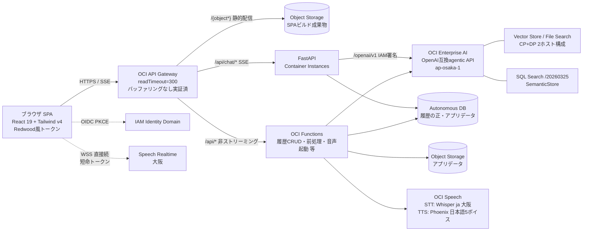

# specs/00 — アーキテクチャ（確定版）

状態: **承認済み・確定版（2026-06-10 人間チェックポイント①）**。ADR-0001〜0005承認済み。以降の変更は新規ADRによる。

## システム構成（検証済み + フィードバック反映）

> 表記について: 本書で「OCI Enterprise AI」と書く対象は、従来「OCI Generative AI」と表記していたものと同一（OpenAI互換agentic API = Responses / Conversations / Files / Vector Stores / File Search / Code Interpreter を含むオファリング）。コンソール/IaaSドキュメント上のサービス名はGenerative AIのままだが、オファリング名としてEnterprise AIに統一する（チェックポイント①での確認に基づく）。

## レイヤ別の決定（Phase 0実証結果）

| 領域 | 決定 | 根拠 |
|---|---|---|
| LLM接続 | OpenAI互換 `/openai/v1`（IAM署名, oci-genai-auth）。**Responses API（gpt-oss/llama）+ Chat Completions（Gemini）の2系統サポート必須**。Cohereはネイティブ第3系統（Phase 2で要否判断） | SPIKE-01 |
| デフォルトモデル | 標準=gpt-oss-120b（TTFT 0.8s, agentic対応）/ 軽量=llama-3.3-70b（TTFT 0.07s）/ 高品質=gemini-2.5-pro（TTFT 10s超→思考中UI必須） | SPIKE-01 |
| ストリーミング経路 | **API Gateway経由で確定**（バッファリングなし、330秒連続実証）。keepaliveコメント送出を実装要件化 | SPIKE-02 / ADR-0003 |
| フロント配信 | **静的サイトホスティング（API Gateway → Object Storage）**。本家JetUseのCloudFront+S3相当。同一GW配下でAPIと同一オリジン化（CORS不要）。パスマッピング・SPAフォールバックはINFRA-01で実機検証 | ユーザー指示 / ADR-0004 |
| API実行基盤 | **非ストリーミングAPIはOCI Functions、SSE系（チャット応答）のみContainer Instances**。FunctionsはSSE不可（応答一括返却・6MB上限・同期300秒上限）のためストリーミングはCI維持。共通ロジックは共有パッケージ化 | ユーザー指示 / ADR-0005 |
| RAG主バックエンド | **Vector Store + File Search採用**（日本語直接検索10/10、ツール強制で正答10/10・引用9/10）。docx非対応→前処理必須。Select AI RAGは比較オプション | SPIKE-03 |
| 会話状態 | **履歴の正はADB**、OCI Conversationsは実行時コンテキスト。Projectsをテナント分離単位に利用可 | SPIKE-05 / ADR-0002 |
| NL2SQL | SQL Search（SemanticStore、大阪提供確認済み）。enrichmentに**テナンシIAM事前作業が必要**（docs/setup/iam.md）。Select AIフォールバック実証済み（9/10） | SPIKE-04 |
| 音声 | 議事録先行は維持しつつ、**音声チャットv1も成立可能と判明**（STT大阪+TTS Phoenix日本語5ボイス・1.3s/文）。リアルタイムSTTはpartialなし→半二重UI | SPIKE-06 |
| UI | React + Tailwind v4 + Redwood風トークン（JET不採用）。branding.jsonリブランド実証済み。JetUse(MIT-0)からMarkdown/Mermaid/ストリーミング/フォーム生成ロジックを移植 | SPIKE-07 |
| 認証 | IAM Identity Domain OIDC (PKCE) → JWT検証（Phase 1 INFRA-02、未検証） | - |

## OpenAI互換APIの実装注意（実機で確定した未文書仕様）

1. ホストが2つ: 推論系=`inference.generativeai...:/openai/v1`、Vector Store本体CRUD=`generativeai...:/20231130/openai/v1`
2. Files/Conversations等の状態APIは `OpenAi-Project` ヘッダ（GenerativeAiProject OCID）必須
3. Vector Store作成はCP `completed` 後もDP可視化まで10〜30秒の伝播遅延
4. `GET /models` は非対応 → モデル列挙は管理API（model-collection）
5. SQL SearchはAPIバージョン `/20260325`（CLIデータプレーンコマンドなし、raw署名リクエストで叩く）
6. Speech realtime WHISPERモード: `modelType=WHISPER`、`shouldIgnoreInvalidCustomizations`/`finalSilenceThresholdInMs` 送信不可

## スコープ修正（計画書からの差分）

- モデル: Grok系・Llama 4系は大阪非提供のため除外（ADR-0001）。Grok 4.1 Fastは2026-08-15リタイア予定
- docx取り込み: Vector Store非対応のためアプリ側前処理（python-docx）をRAG-01に追加
- 音声チャット: TTS日本語が利用可能（Phoenix）と判明したため、VOICE-03の優先度引き上げを提案
- WebSocket（リアルタイムSTT）はAPI GW非対応 → クライアント直接続（短命トークン）をVOICE-02で設計

## 人間チェックポイント①の承認事項

2026-06-10 一次フィードバック受領・反映済み:
- フロントは静的ホスティング（API GW → Object Storage）→ ADR-0004として反映
- 実行基盤は不自然でない範囲でOCI Functions → ADR-0005として反映（SSE系のみCI維持）
- 「OCI Generative AI」表記は「OCI Enterprise AI」のこと → 表記を統一（構成図下の注記参照）

**2026-06-10 承認済み**: 本アーキテクチャ（上表11行）+ ADR-0001〜0005 → Phase 1着手。

未完の残作業（Phase 1と並行可）:
1. SPIKE-07ギャラリーのルック&フィール承認（ssh -L 4173:localhost:4173 → http://localhost:4173）
2. SQL Search用テナンシIAM作業の実施（docs/setup/iam.md）→ 完了次第SPIKE-04を完結
3. スパイクリソースの残置/削除判断（jetuse-spike-* 一覧は docs/verification/ 各レポート末尾）
